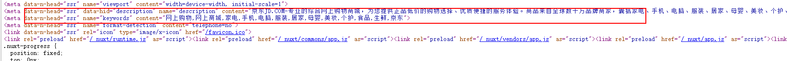
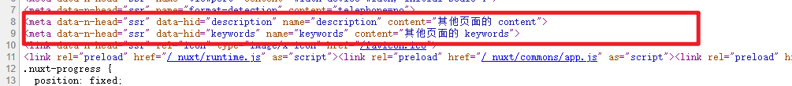
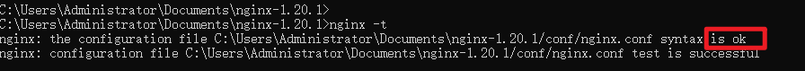
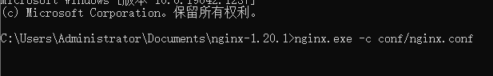
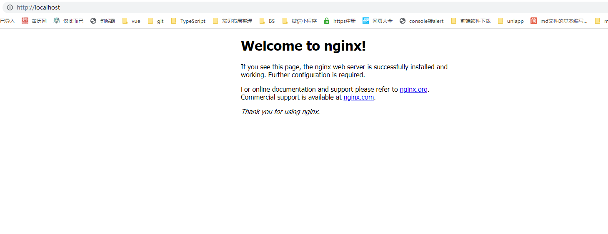
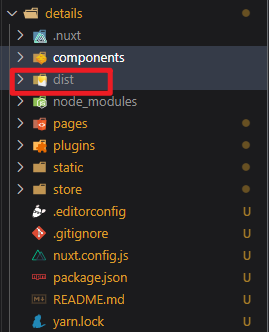
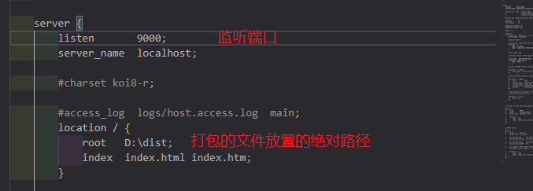

# day-05

## Loading

### 为什么增加loading状态展示

- 在开发网站的时候，出现端口指定时间内没有返回数据，为了提升用户体验，所以增加loading状态

### 实现思路
1. 在components文件夹中定义loadingBar.vue 并在其内部定义开始和结束两个方法
2. nuxt.config.js 配置loading
3. 在页面中使用组件

### 代码
`components/LoadingBar.vue`
```vue
<template>
  <div v-if="show" class="loading">
    <h1>正在加载中...</h1>
  </div>
</template>

<script>
export default {
  data() {
    return {
      show: false
    }
  },
  methods: {
    // 开始加载
    start() {
      this.show = true
    },
    // 结束加载
    finish() {
      this.show = false
    }
  }
}
</script>

<style>
.loading {
  width: 500px;
  margin: 0 auto;
}
</style>
```
`nuxt.config.js`
```js
export default {
  // Global page headers: https://go.nuxtjs.dev/config-head
  head: {
    title: 'loading',
    htmlAttrs: {
      lang: 'en'
    },
    meta: [
      { charset: 'utf-8' },
      { name: 'viewport', content: 'width=device-width, initial-scale=1' },
      { hid: 'description', name: 'description', content: '' },
      { name: 'format-detection', content: 'telephone=no' }
    ],
    link: [
      { rel: 'icon', type: 'image/x-icon', href: '/favicon.ico' }
    ]
  },

  build: {
  },
  // 加载状态显示
  loading: "~/components/LoadingBar.vue"
}
```
**正式使用组件**
`pages/index.vue`
```vue
<template>
  <div class="index">
    <h1>首页</h1>
    <LoadingBar></LoadingBar>
  </div>
</template>

<script>
export default {
  mounted() {
    // 首先保证可以获取到dom实例
    this.$nextTick(() => {
      // 让组件刚进入的时候显示正在加载...
      this.$nuxt.$loading.start();
      setTimeout(() => {
        // 让组件显示的时候加载完毕 消失
        this.$nuxt.$loading.finish();
      }, 3000);
    });
  },
};
</script>

```

## Head配置
> 在开发网站时，为了提升SEO优化，出了SSR，还可以设置TDK
- TDK: T-title D-description K-Keywords
### 实现思路
1. 在nuxt.config.js中配置全局Head
2. 在页面中配置Head

### 代码
1. nuxt.config.js
```js
export default {
  // Global page headers: https://go.nuxtjs.dev/config-head
  head: {
    title: 'head-config',
    htmlAttrs: {
      lang: 'en'
    },
    meta: [
      { charset: 'utf-8' },
      { name: 'viewport', content: 'width=device-width, initial-scale=1' },
      // description hid：用于各个不同的页面可能会有不同的content（这是页面自动配置所需要的属性） content：添加的描述
      { hid: 'description', name: 'description', content: '京东JD.COM-专业的综合网上购物商城，为您提供正品低价的购物选择、优质便捷的服务体验。商品来自全球数十万品牌商家，囊括家电、手机、电脑、服装、居家、母婴、美妆、个护、食品、生鲜等丰富品类，满足各种购物需求。' },

      { name: 'keywords', content: '网上购物,网上商城,家电,手机,电脑,服装,居家,母婴,美妆,个护,食品,生鲜,京东'},
      { name: 'format-detection', content: 'telephone=no' }
    ],
    link: [
      { rel: 'icon', type: 'image/x-icon', href: '/favicon.ico' }
    ]
  },
}
```

2. 页面自己配置description
```vue
<template>
  <div>
    <h1>其他页面</h1>
  </div>
</template>

<script>
export default {
  head() {
    return {
      title: "其他页面标题",
      meta: [
        {
          hid: "description",
          name: "description",
          content: "其他页面的 content",
        },
        {
          hid: "keywords",
          name: "keywords",
          content: "其他页面的 keywords",
        },
      ],
    };
  },
};
</script>
```

index.vue



otherpages.vue



### 总结
1. 在nuxt.config.js中的meta属性中的hid代表自定义识别，如果想在某些页面中修改在head的某些页面属性值，添加his之后，再在页面中修改，也就是说拥有了hid就可以让页面覆盖全局配置的其属性

## fetch

### 实现思路
1. 在store/index.js 定义state和mutations
2. 在plugins/axios.js中 完成axios的封装
3. 在组件中使用fetch把接口返回的数据填充到vuex中
4. 页面中使用vuex提供数据，渲染页面

### 代码
**vuex：**`store/index.js`
```js
// 存放公共数据
export const state = () => {
  return {
    topics: []
  }
}
// 修改数据同步方法
export const mutations = {
  updataTopics(state,payload) {
    state.topics = payload
  }
} 
```

**axios的封装：**`plugins/axios.js`
```js
import axios from "axios";
export default (context, inject) => {
  // 基准地址
  axios.defaults.baseURL = "https://cnodejs.org/api/v1"
  inject('api', {

    /**
     * 加载主题列表
     * @param {String} path 
     * @returns Promsie
     */
    getTopics(path) {
      return axios.get(path)
    }
  })
}
```

`component/Goods.vue`
```vue
<template>
  <div class="goods">
    <ul>
      <li v-for="item in $store.state.topics" :key="item.id">
        <nuxt-link to="/detail">{{ item.title }}</nuxt-link>
      </li>
    </ul>
  </div>
</template>

<script>
export default {
  
  // 可以在组件中使用
  async fetch() {
    const {
      data: { data: topics },
    } = await this.$api.getTopics("/topics");
    this.$store.commit("updataTopics", topics);
  },
  // 无打印，说明async不能再component组件中使用
  // asyncData() {
  //   console.log("goods")
  // },
};
</script>
```

`pages/index.vue`
```vue
<template>
  <div class="index">
    <h1>fetch</h1>
    <Goods />
  </div>
</template>
```

**挂载axios插件**`nuxt.config.js`
```js
export default {
  plugins: [
    "~/plugins/axios.js"
  ],
}
```

### 总结：
1. 从接口返回的数据传递到vuex中可以在fetch中完成，也是在服务端渲染
2. fetch可以用在任意组件（包括components目录下），asyncData只能使用在页面组件（pages目录下）
3. 如果只需要在客户端渲染，在mounted中处理数据

4. 如果fetch使用了参数就不能使用this了，职位undefined可以解析context形参
```js
async fetch({app,store}) [
  const {data: {data: topics}} = await app.$api.getTopics("/topics")
  store.commit('updateTopics', topics)
]
```

#### Fetch和asyncData的区别
1. 数据分为vuex公共数据还有仅使用在单独页面中的数据，对于接口数据的处理，需要存放在vuex中就是用fetch，否则就使用asyncData

2. asyncData中返回的数据可以直接在页面中使用，fetch中返回的数据无法使用，但是可以通过fatch修改data中定义过的数据
`pages/index.vue`
```vue
<template>
  <div class="index">
    <!-- <h1>fetch</h1> -->
    <p>{{msg}}</p>
    <p>{{age}}</p>
    <Goods />
  </div>
</template>
<script>
export default {
  data() {
    return {
    age: 0
    }
  },
  asyncData() {
    return {
      msg: "我是asyncData返回的数据"
    }
  },
  fetch() {
    this.age=20
    return {
      // ! 不能直接使用通过fetch中的数据
      // age: "我是fetch返回的数据"
    }
  }
}
</script>
```

## 服务端执行的生命周期
|功能 | 执行的位置 |
| :-----: | :-----: |
| 中间件 | 服务器或者路由器更新 |
| asyncData | 服务器或里路由器更新 |
| fetch | 服务器或者路由器更新 |
| beforeCreated created | 页面初始化连段都执行或者路由更新在客户端执行 |
| nuxtServerInt | 服务器端 |

### 总结

1. 运行在客户端和服务端的生命周期钩子
beforeCreate、created、asyncData、 fetch 中间件
2. 只能运行在客户端
vue2提供的生命周期钩子出了created、beforecreate

## 列表详情课堂案例

### 实现目标
> 点击问题列表跳转到问题详情页面，并且拿到数据渲染详情页

### 代码
`plugins/axios.js`
```js
import axios from "axios";
export default (context, inject) => {
  // 基准地址
  axios.defaults.baseURL = 'https://cnodejs.org/api/v1';
  inject("api", {
    /**
     * 加载主题列表
     * @param {String} path 
     * @returns Promise
     */
    getTopics(path) {
      return axios.get(path)
    },
    /**
     * 加载主题详情
     * @param {String} path 
     * @returns Promise
     */
    getTopicsDetail(path) {
      return axios.get(path)
    }
  })
}
```

`store/index.js`
```js
// 公共数据
export const state = () => {
  return {
    topics: []
  }
}

// 修改数据的同步方法
export const mutations = {
  updateTopics(state, payload) {
    state.topics = payload
  }
}
```

`pages/index.vue`
```vue
<template>
  <div class="index">
    <h1>首页</h1>
    <u>
      <li v-for="item in $store.state.topics" :key="item.id">
        <!-- 动态传递id -->
        <nuxt-link :to="`/detail?id=${item.id}`">{{item.title}}</nuxt-link>
      </li>
    </u>
  </div>
</template>

<script>
export default {
  async fetch({app,store}) {
    const {data: {data: topics}} = await app.$api.getTopics('/topics');
    store.commit("updateTopics",topics)
  }
}
</script>
```

`pages/detail.vue`
```vue
<template>
  <div class="detail">
    <h1>详情：details</h1>
    <p>标题{{detail.title}}</p>
    <p v-html="detail.content"></p>
  </div>
</template>

<script>
export default {
  async asyncData({query,app}) {
    const {data: {data: detail}} = await app.$api.getTopicsDetail("/topic/"+query.id)
    return {
      detail
    }
  }
}
</script>
```
`nuxt.config.js`
```js
export default {
  plugins: [
    "~/plugins/axios.js"
  ],
}
```

### 总结
1. 加入接口返回的是html标签包裹的内容，我们可以使用v-html解析这段数据
```html
<p v-html="detail.content"></p>
```
2. async或者fetch中的第一个参数结构出params.参数名 query.参数名
```js
async asyncData({query,app}) {
  const {data: {data: detail}} = await app.$api.getTopicsDetail("/topic/"+query.id)
  return {
    detail
  }
}
```

## 项目部署
开发过程结束之后，就会进入项目测试流程，测试完毕并且bug修复完毕，下一个环节就是项目部署上线

### nginx
> 高效轻量的web服务器

1. 下载安装nginx
[nginx安装](http://nginx.org/en/download.html)
2. 解压压缩文件放到指定位置（我放置在了c盘文档的位置C:\Users\Administrator\Documents\nginx-1.20.1）
3. 输入nginx -t 校验是否配置正确



4. 在`nginx`目录打开cmd 输入命令 nginx.exe -c conf/nginx.conf



5. 打开[localhost:80](http://localhost:80) 看见如下图的页面即可显示页面 代表正常执行



### 项目部署打包

#### 开发时和开发完
```
开发时：
      yarn dev

开发完
    1. 静态部署
      网站静态化：将网站所有页面调用到的接口，动态交互 全部渲染成了html静态页面和css

      优势：用户访问速度快
      劣势：不能进行实时更新，部分类型的网站不能进行实时变化比如股票网站 
      
      对于数据不频繁进行更新的网站也可以进行静态化，可以定时凌晨进行更新打包发布

      - 执行静态部署打包命令 
        yarn generate
    2. 动态部署
    本质上开启一个node服务，帮你的网站通过node启动项目

    优势：数据可以实时更新
    劣势：用户访问会变慢
```

#### 静态部署
1. 打包项目
  yarn generate
  项目目录就会出现dist文件夹

  

2. 把打包好的dist问价夹放置在任意盘符目录下，我放在了D盘根目录

3. 修改nginx-1.20.1/conf/nginx.conf中的36行和42-45

   

4. 

