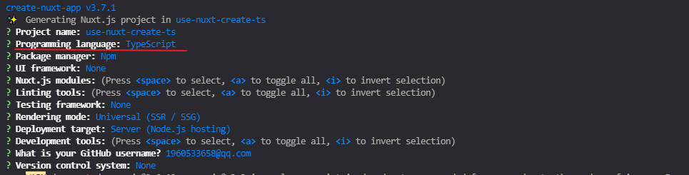

# day-06

## 案例-权限校验（permission-checked）

### 实现思路
1. pages 新建三个文件 `index.vue` `login.vue` `my.vue`

2. 两个接口 登录和退出

3. 登录之后把接口返回的用户信息存储到vuex中

4. 使用中间件读取vuex中的用户数据，判断用户是否已经登录

5. 首页根据vuex中是否读取到用户信息来判断显示对应的内容

6. 如果用户退出登录,清空vuex中的数据

#### 代码实现
- 为了方便的使用cookie，所以需要下载两个包
```shell
npm i js-cookie
yarn add cookie-parser
```
- 使用中间件完成登录校验功能
`middleware/auth.js`
```js
export default ({ store, redirect}) => {
  // 是否已登录
  if(!store.state.auth) redirect("/login")
}
```
`pages/index.vue`
```vue
<template>
  <div class="index">
    <h1>首页</h1>
    <div v-if="!$store.state.auth">
      您未登录 Plass <nuxt-link to="login">Login</nuxt-link>
    </div>
    <div v-else>
      您已登录请前往 <nuxt-link to="my">我的页面</nuxt-link>
      <div>
        <button @click="loginout">退出登录</button>
      </div>
    </div>
  </div>
</template>

<script>
import Cookie from "js-cookie"
export default {
  created() {
    console.dir(Cookie)
  },
  methods: {
    // 退出登录
    loginout() {
      setTimeout(() => {
        // 清空state中的数据
        this.$store.commit("updateStatus", "");
        // 删除cookie
        Cookie.remove("auth")
      }, 1000);
    }
  }
};
</script>
```
`login.vue`
```vue
<template>
  <div class="login">
    账号：<input type="text" name="user" id="1" />
    <br />
    密码：<input type="password" name="password" id="1" />
    <br />
    <button @click="login">登录</button>
  </div>
</template>

<script>
import Cookie from "js-cookie";
export default {
  methods: {
    login() {
      // 定义登录密钥
      const auth = "sadsadsadsadasdsasadsad";
      setTimeout(() => {
        // 存储用户数据到vuex中
        this.$store.commit("updateStatus", auth);
        // 存储cookie
        Cookie.set("auth", auth);
        // 跳转首页
        this.$router.push("/");
      }, 1000);
    },
  },
};
</script>
```

`pages/my.vue`
```vue
<template>
  <div class="my">
    <h1>我的页面</h1>
    <nuxt-link to="/">返回首页</nuxt-link>
  </div>
</template>

<script>
export default {
  // 使用页面中间件
  middleware: "auth"
}
</script>
```

## nuxtServerInit

### 应用场景
> vuex可以保证项目每个页面都可以访问公共数据，但是页面刷新之后，vuex数据就会清空，而使用了nuxtServerInit就可以完美解决刷新之后vuex被清空的问题

### 实现思路
1. store/index.js中创建actions，把nuxtServerInit引用（只能在store/index.js中的actions中使用）
2. nuxtServerInit只能运行在服务端，可以通过相关参数读取到 `请求对象` 
3. 只在服务端执行一次

### 代码实现
`store/index.js`
```js
export const state = () => {
  return {
    auth: ""
  }
}

export const mutations = {
  updateStatus(state, payload) {
    state.auth = payload
    console.log(payload)
  }
}

export const actions = {
  nuxtServerInit({commit}, {req}) {
    commit("updateStatus", "sadasdsa")
  }
}
```

## 使用nuxtServerInit完善权限校验

### 实现思路
1. 使用js-cookie包在登录时设置cookie 退出登录时 删除cookie

2. 通过结构nuxtServerInit中的第二个参数获取req对象读取cookie

3. 通过cookie--parser 包 把cookie字符串转成对象

### 代码实现
`store/index.js`
```js

// 引入cookieparser
const cookieParser =  require("cookieparser");
export const state = () => {
  return {
    auth: ""
  }
}

export const mutations = {
  updateStatus(state, payload) {
    state.auth = payload
  }
}

export const actions = {
  nuxtServerInit({commit}, {req}) {
    // console.log(context, "context")
    // console.log(app)
    let auth = "";
    commit("updateStatus", "")
    // 判断用户是否已经登录
    if (req.headers.cookie) {
      let parser = cookieParser.parse(req.headers.cookie)
      auth = parser.auth
    }
    commit("updateStatus", auth)
    // console.log(parser);
  }
}
```

## nuxt创建ts项目
1. `下载命令`
```shell
npm init nxut-app use-nuxt-create-ts
```
2. 在`Programming language`中选择 Typescript

   

### ts在nuxt项目中的基本使用
1. 手心需要下载两个包
```shell
yarn add uve-property-decorator
yarn add vue-class-component
```

2. 使用类创建组件

3. 在类中定义一个msg

4. 在首页模板中使用这个msg变量
`pages/index.vue`
```vue
<template>
  <div class="index">
    <h1>{{msg}}</h1>
  </div>
</template>

<script lang="ts">
import {Vue} from "vue-property-decorator";
export default class PageIndex extends Vue {
  msg: String = "hello kangkang"
}
</script>
```

### ts在nuxt实现计算器
```vue
<template>
  <div class="index">
    <h1>{{ msg }}</h1>
    <p>{{ num }}</p>
    <button @click="increment">＋</button>
    <br />
    <button @click="deIncrement">-</button>
  </div>
</template>

<script lang="ts">
import { Vue,Component } from "vue-property-decorator";
// 使用装饰器，让类组件拥有原本 组件应该有的功能
@Component
export default class PageIndex extends Vue {
  msg: String = "hello kangkang";
  num: number = 10;
  increment() {
    this.num+=1
  }
  deIncrement() {
    this.num-=1
  }
}
</script>
```

### 在nuxt中使用compositionAPI（vue3）
> nuxt内置的包内只有vue2，如果要使用则需要vue3 `@vue/composition-api`
[compositions-api](https://www.npmjs.com/package/@vue/composition-api)
1. 下载`@vue/composition-api`
```
npm install @vue/composition-api
# or
yarn add @vue/composition-api
```
2. 在插件中注册composition-api
`nuxt.config.js`
```js
export default {
  // Plugins to run before rendering page: https://go.nuxtjs.dev/config-plugins
  plugins: [
    '~/plugins/composition-api.js'
  ],
}
```
3. 把`@composition-api.js`挂载到Vue实例中
`plugins/composition-api.js`
```js
import Vue from "vue“;
import VueCompositionApi from "@vue/composition-api";
Vue.use(VueCompositionApi)
```
3. 在页面中使用vue3的写法
`pages/index.vue`
```vue
<template>
  <div class="index">
    <h1>{{msg}}</h1>
  </div>
</template>

<script lang="ts">
import { defineComponent, ref } from "@vue/composition-api"

export default defineComponent({
setup() {
  const msg = ref("你好 康康");
  return {
    msg
  }
}
});
</script>
```

#### nuxt使用composition Api完成计算器

```vue
<template>
  <div class="index">
    <h1>{{ msg }}</h1>
    <p>{{ count }}</p>
    <button @click="increment">+</button>
    <br />
    <button @click="deIncrement">-</button>
  </div>
</template>

<script lang="ts">
import { defineComponent, ref } from "@vue/composition-api";

export default defineComponent({
  setup() {
    const msg = ref("你好 康康");
    const count = ref<number>(0);
    const increment:Function = ():void => {
      count.value++;
    };
    const deIncrement:Function = ():void => {
      count.value--;
    };
    return {
      msg,
      count,
      increment,
      deIncrement,
    };
  },
});
</script>
```

#### nuxt使用composition Api完成计算器 方法抽离
`pages/index.vue`
```vue
<template>
  <div class="index">
    <h1>{{ msg }}</h1>
    <p>{{ count }}</p>
    <button @click="increment">+</button>
    <br />
    <button @click="deIncrement">-</button>
  </div>
</template>

<script lang="ts">
import { defineComponent, ref } from "@vue/composition-api";

// #region 功能方法抽离
const counter: Function = (ref:Function) => {
  const count = ref(0);
  const increment: Function = (): void => {
    count.value++;
  };
  const deIncrement: Function = (): void => {
    count.value--;
  };
  return {
    count,
    increment,
    deIncrement,
  };
};
// #endRegion

export default defineComponent({
  setup() {
    const msg = ref<string>("你好 康康");
    return {
      msg,
      ...counter(ref),
    };
  },
});
</script>
```
## http模块
> `@nuxt/http` nuxt内置的http请求库
1. 安装`@nuxt/http模块`
```shell
yarn add @nuxt/http
```
3. 在nuxt.congfig.js中 注册moddle实例
`nuxt.config.js`
```js
modules: [
'@nuxt/http'
],
```
2. 在页面中使用该模块，调用文档列表接口渲染页面
`pages/index.vue`
```vue
<template>
  <div class="index">
    <ul>
      <li v-for="item in topics" :key="item.id">
        <nuxt-link :to="`/detail/?id=${item.id}`">{{item.title}}</nuxt-link>
      </li>
    </ul>
  </div>
</template>

<script>
export default {
  async asyncData({$http}) {
    const {data:topics}  = await $http.$get("https://cnodejs.org/api/v1/topics")
    console.log(topics)
    return {
      topics
    }
  }
}
</script>
```