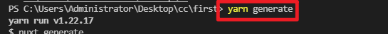
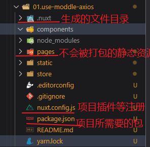
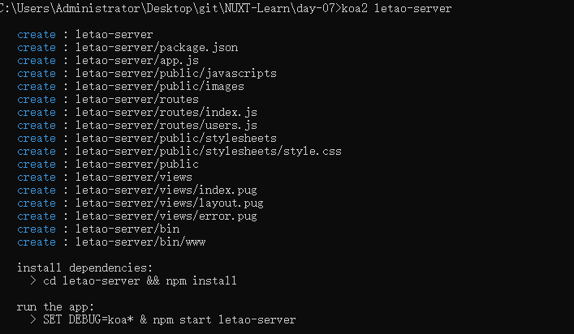
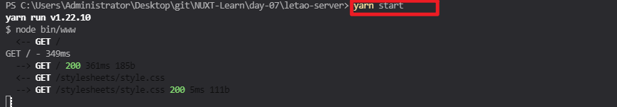
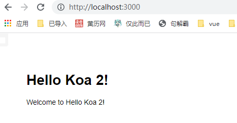

# day-07

## axios模块
> axios是nuxt内置的模块

1. 下载axios包
```shell
yarn add @nuxtjs/axios
```
2. 在`nuxt.config.js`中 配置axios宝
```js
modules: [
  '@nuxtjs/axios'
],
```
3. 在页面中使用 `axios` ，`asyncData`结构出`$axios`
`pages/index.vue`
```vue
<template>
<div class="index">
  <ul>
    <li v-for="item in topics" :key="item.id">
      <nuxt-link :to="`/detail?id=${item.id}`">{{item.title}}</nuxt-link>
    </li>
  </ul>
</div>
</template>

<script>
export default {
  // ! 解构axios的方法 使用axios中的$get 获取数据
  async asyncData({$axios}) {
    const {data: topics} = await $axios.$get('https://cnodejs.org/api/v1/topics') 
    return {
      topics
    }
  }
}
</script>
```
`pages/detail.vue`
```vue
<template>
  <div>
    <h1>{{detail.title}}</h1>
    <div v-html="detail.content"></div>
  </div>
</template>

<script>
export default {
  /**
   * 结构axios， 获取axios插件库中的方法
   * 结构query， 获取页面路由传递过来的数据
   */
  async asyncData({$axios,query}) {
    const {data: detail} = await $axios.$get(`https://cnodejs.org/api/v1/topic/${query.id}`)
    return {
      detail
    }
  }
}
</script>
```

## 服务端部署

### 静态化部署
> 网站静态化就是把项目每一个页面做成静态页面，把每个页面调用接口渲染页面 在服务器端完成，但是会导致数据无妨实时更新

**关于静态化部署详细步骤可参考NUXT-Learn/day-05/day-05.md中的静态部署**
#### 代码实现
1. 开发完毕 使用命令 yarn generate
2. 生成dist目录
3. 把dist文件夹放到服务器指定位置
4. 使用nginx配置 在nginx-1.20.1中使用cmd 输入命令:
```shell
nginx.exe -c conf/nginx.conf
```
**注意：**不要使用查询参数，建议使用路径参数，因为会把参数写在一个页面中


#### 将查询参数修改为路径参数
`pages/index.vue`
```vue
<template>
<div class="index">
  <ul>
    <li v-for="item in topics" :key="item.id">
      <!-- 查询参数
        <nuxt-link :to="`/detail?id=${item.id}`">{{item.title}}</nuxt-link>
      -->
      <!-- 路径参数 -->
      <nuxt-link :to="`/detail/${item.id}`">{{item.title}}</nuxt-link>
    </li>
  </ul>
</div>
</template>

<script>
export default {
  // ! 解构axios的方法 使用axios中的$get 获取数据
  async asyncData({$axios}) {
    const {data: topics} = await $axios.$get('https://cnodejs.org/api/v1/topics') 
    return {
      topics
    }
  }
}
</script>
```

> 由于查询参数在nuxt中的解析方式不一样 所以我们需要创建一个detail文件夹，再在里面的vue文件中通过params中获取到数据
`pages/detail/_id.vue`
```vue
<template>
  <div>
    <h1>{{detail.title}}</h1>
    <div v-html="detail.content"></div>
  </div>
</template>

<script>
export default {
  //#region  路径参数获取路径数据
  async asyncData({$axios,params}) {
    // ! 注意 当前vue文件名是什么 params.文件名
    const {data: detail} = await $axios.$get(`https://cnodejs.org/api/v1/topic/${params.id}`)
    return {
      detail
    }
  }
  //#endregion
  
}
</script>
```


## nuxt动态部署
> 动态部署本质上就是开启一个服务器，运行你的前端项目
优势:
  数据是最新的
缺点：
  网页呈现访问速度比静态部署慢

### 实现方式
1. 开发完成 使用 yarn generate之后 把打包生成好的目录一起放到指定目录中（不止生成一个问价夹哦）

  
  `需要将以下内容移动到服务器指定位置`

  


2. yarn 安装需要的包
- 可以在自己打包放置到服务器指定的目录之后 使用命令 yarn 下完包之后 
3. 再运行yarn start之后进入试运行查看打包的网站是否存在错误

## 乐淘项目
### 技术栈
#### 后端开发语言
> Koa 以及为了快速创建项目 使用了Koa脚手架
#### 数据库
> mySql

#### 服务器
> 腾讯云 window server 2012 

### 后端开发流程
1. 先看设计稿
2. 有多少页面
3. 每个页面需要用到哪些接口 以及接口功能 
提前先思考好要设计数据库中选哟多少表 表内需要哪些字段 数据库完成之后 ，使用KOA完成接口的开发，使用PostMan测试接口是否正常

### 项目实现思路
一共四个页面
- 首页页面 接口
  - `swiper` 轮播图端口 提供首页页面 `轮播图数据`
  - `gridList` 宫格接口 提供首页页面 `宫格数据`
  - `sport` 运动专区接口 提供首页页面 `运动专区数据`
  - `brandList` 品牌专区接口 提供首页页面  `品牌专区数据`
- 分类页面 接口
  - 一级分类 oneCategoryList 提供分类页面 `一级分类列表` 数据库中需要新建分类表 
  - 二级分类 twoCategoryList 提供分类页面 `根据id获取二级分类列表`  

### Koa项目初始化

1. 前往[npm官网搜索Koa脚手架 koa-generator](https://www.npmjs.com/package/koa-generator)搜索Koa脚手架
注意：npm 以管理员身份启动 再使用以下命令全局安装
```shell
npm install -g koa-generator
```
2. 使用koa脚手架生成项目

**创建项目命令语法**： koa2 项目名称
```shell
koa2 letao-server
```



3. 安装所需基本库
```shell
npm install
`or`
yarn
```

4. 运行项目命令
```shell
npm run start
`or`
yarn start / yarn dev
```
yarn start 和 yarn dev的区别
yarn start 是使用`node` 启动的项目 不会在文件修改之后自动重新执行
yarn dev 是使用`nodemon` 启动的项目 会在文件修改之后自动重新执行







### Koa项目脚手架目录结构
> 掌握项目初始化所自动创建的文件和文件夹
```file
|-- app.js  后端的绝对入口文件 路由、库的挂载都在这里
|-- package.json
|-- yarn.lock
|-- bin
|   |-- www ~~ 服务启动文件 
|-- public ~~ 公共文件
|   |-- images ~~ 图片防止区域
|   |-- javascripts ~~ js文件
|   |-- stylesheets ~~~ 样式
|       |-- style.css
|-- routes  ~~ 路由文件夹
|   |-- index.js  ~~ 首页路由文件
|   |-- users.js  ~~ 用户路由文件
|-- views  ~~ 模板文件
    |-- error.pug
    |-- index.pug
    |-- layout.pug
```

### Koa项目核心文件代码
`app.js`

```js
const Koa = require('koa') // Koa包
const app = new Koa()  // 创建app服务
const views = require('koa-views')  // 处理静态资源
const json = require('koa-json')  // 页面显示的json数据格式化
const onerror = require('koa-onerror') // 处理异常
const bodyparser = require('koa-bodyparser')  // 解析post请求
const logger = require('koa-logger')  // 记录日志

// 加载路由
const index = require('./routes/index')
const users = require('./routes/users')

// error handler 错误处理
onerror(app)

// middlewares 中间件
app.use(bodyparser({
  enableTypes:['json', 'form', 'text']
}))
app.use(json())
app.use(logger())
app.use(require('koa-static')(__dirname + '/public'))

app.use(views(__dirname + '/views', {
  extension: 'pug'
}))

// logger  记录日志
app.use(async (ctx, next) => {
  const start = new Date()
  await next()
  const ms = new Date() - start
  console.log(`${ctx.method} ${ctx.url} - ${ms}ms`)
})

// routes 注册路由
app.use(index.routes(), index.allowedMethods())
app.use(users.routes(), users.allowedMethods())

// error-handling 一旦监听到异常 就打印报错信息
app.on('error', (err, ctx) => {
  console.error('server error', err, ctx)
});

module.exports = app
```

**`bin/www`**
```js
var app = require('../app');  // 导入app.js
var debug = require('debug')('demo:server');
var http = require('http'); // 加载http模块
// 判断是否存在自定义的端口，如果没有 使用3000端口
var port = normalizePort(process.env.PORT || '3000');
// 代码中的注册 路由全部启动
var server = http.createServer(app.callback());

/**
 * Listen on provided port, on all network interfaces.
 */

server.listen(port);
server.on('error', onError);
server.on('listening', onListening);

/**
 * Normalize a port into a number, string, or false.
 */

function normalizePort(val) {
  var port = parseInt(val, 10);

  if (isNaN(port)) {
    // named pipe
    return val;
  }

  if (port >= 0) {
    // port number
    return port;
  }

  return false;
}

/**
 * Event listener for HTTP server "error" event.
 */

function onError(error) {
  if (error.syscall !== 'listen') {
    throw error;
  }

  var bind = typeof port === 'string'
    ? 'Pipe ' + port
    : 'Port ' + port;

  // handle specific listen errors with friendly messages
  switch (error.code) {
    case 'EACCES':
      console.error(bind + ' requires elevated privileges');
      process.exit(1);
      break;
    case 'EADDRINUSE':
      console.error(bind + ' is already in use');
      process.exit(1);
      break;
    default:
      throw error;
  }
}

/**
 * Event listener for HTTP server "listening" event.
 */

function onListening() {
  var addr = server.address();
  var bind = typeof addr === 'string'
    ? 'pipe ' + addr
    : 'port ' + addr.port;
  debug('Listening on ' + bind);
}

```

总结：
使用 bin/www `启动服务` 启动服务时会读取app.js 初始化koa服务，以及路由注册 中间件注册 错误信息处理


