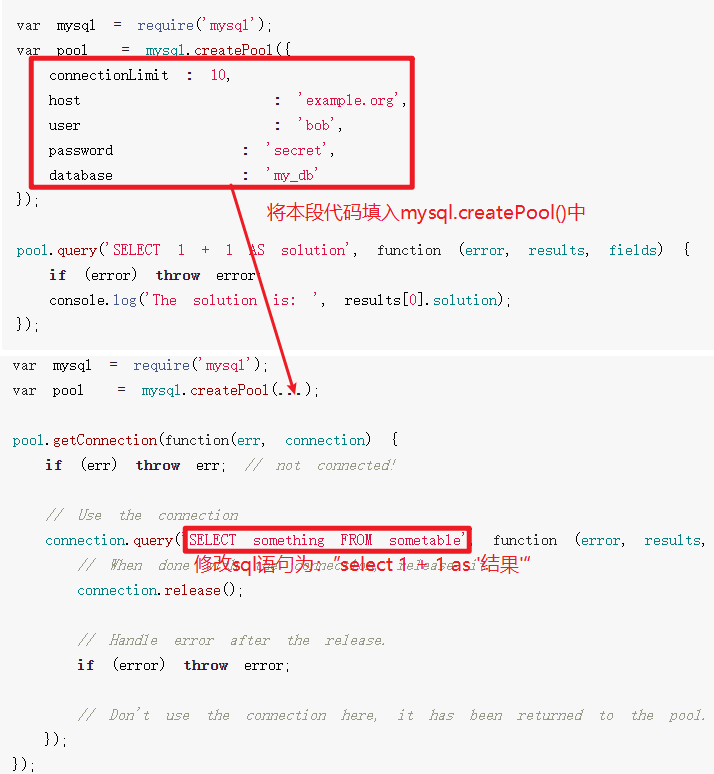
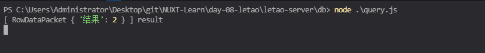
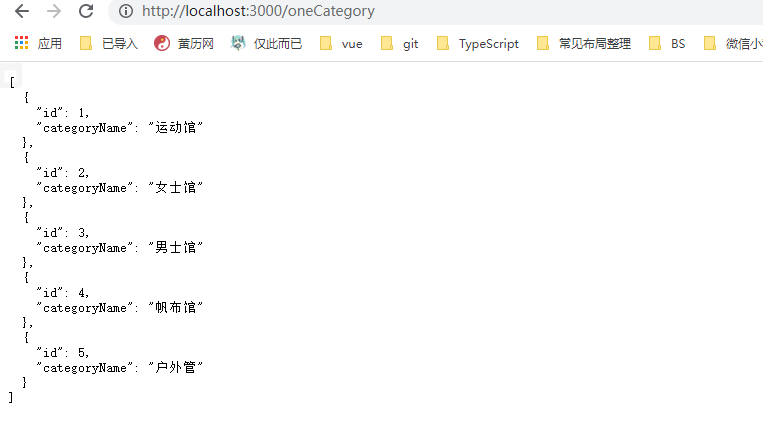
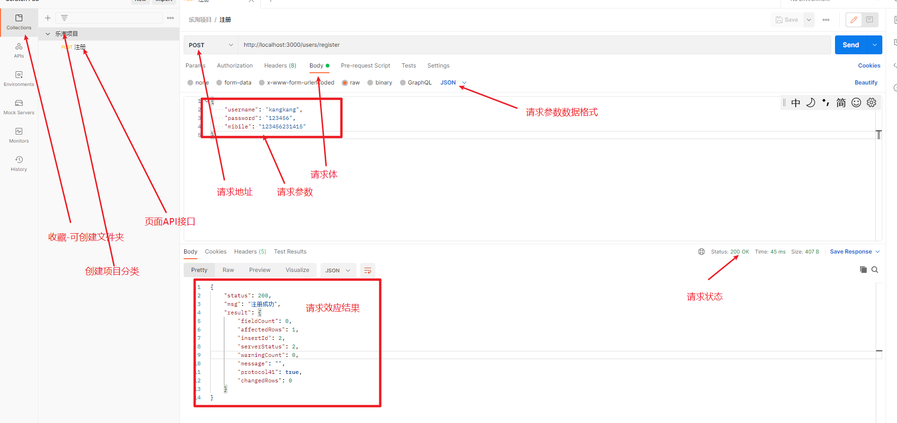
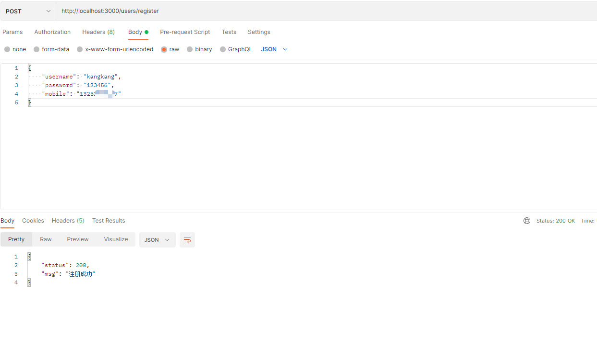
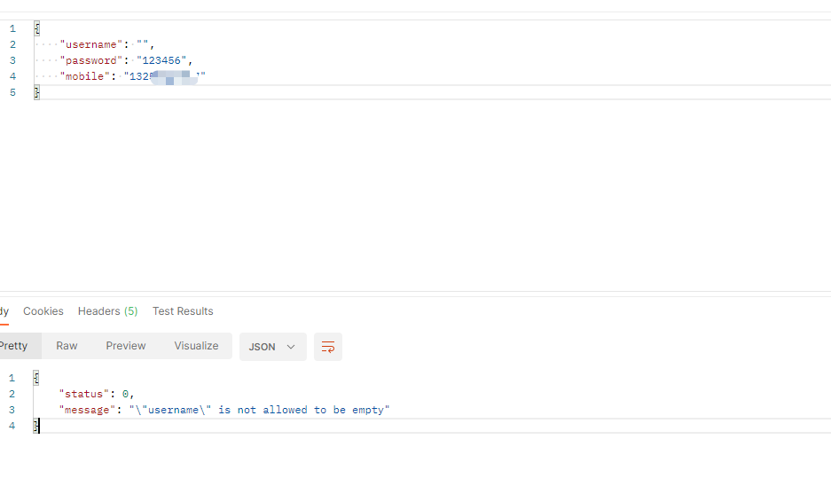

# day-08
> 开发后端
## 首页接口

### 宫格数据 
1. 在路由index.js中新增一个接口为`grandList`的接口
2. 在接口`grandList`中返回数据
`router/index.js`
```js
//#region  首页宫格数据
router.get('/grandlist', async (ctx, next) => {
  ctx.body = {
    status: 200,
    grandList: [
      { id: 1, img_src: "/images/nav1.png" },
      { id: 2, img_src: "/images/nav2.png" },
      { id: 3, img_src: "/images/nav3.png" },
      { id: 4, img_src: "/images/nav4.png" },
      { id: 5, img_src: "/images/nav5.png" }
    ]
  }
})
//#endregion
```


`总结`：
1. 只需要在`routes/index.js`中新增一个api 使用 router.get("/api的名称", (ctx)=> ctx.body={status: 200, grandlist: [{}]})
2. 想让api生效 必须在app.js中导入注册才可以使用

## MVC 设计模式
- MVC 是后端常用的一种设计模式
- M: Model 数据模型
- V: view 视图层 使用model提供的数据 呈现页面
- C: controller 控制层 控制Modle层，在这里逻辑业务的编写
- 优势： 低耦合 数据提供者`model` 不再和view 糅合在一起， 三者相互独立，彻底分离 
> 低耦合：主要都是从对象职责划分的角度说的 封装就是把一些功能放在一个对象之内 高聚合是说一个对象的功能都在内部搞定，紧紧地结合在一起 低耦合是说对象之间的依赖要松散，不要牵一发动全身 只有这样，当系统规模扩大时，才能比较方便（想要了解的更多可以百度）

### 思考MVVM是什么

- MVVM 是前端非常流行的设计思想 只是MVC中的view层
```
M 数据模型
V 视图
VM 模板和数据之前连接的桥梁 Vue实例化时 就是 VM

const Vm = new Vue()
m
data() {}
methods:{}
```

### 总结
- MVC 是后端的一种设计思想 目的时解决 `控制层` `数据层` `视图层` 三者之间的耦合问题
- MVVM: 是针对MVC中的View视图层
  - M: data上的数据
  - V：视图 模板
  - VM： m和V之间的桥梁

## 使用MVC设计模式改造宫格数据

1. 把`routes/index.js` 中的`grandlist接口`按照MVC的结构进行拆分

2. 用户请求接口时 首先会线进入controller层 再控制model层 返回数据给前端(view)

3. controller/index.js 导出了一个grandList控制宫格数据业务

### 代码实现
数据导出`controller/index.js`
```js
module.exports.grandList = async (ctx, next) => {
  ctx.body = {
    status: 200,
    grandList: [
      { id: 1, img_src: "/images/nav1.png" },
      { id: 2, img_src: "/images/nav2.png" },
      { id: 3, img_src: "/images/nav3.png" },
      { id: 4, img_src: "/images/nav4.png" },
      { id: 5, img_src: "/images/nav5.png" }
    ]
  }
}
```
返回数据`routes/indesx.js`
```js
//#region  首页宫格数据
router.get('/grandlist', grandList )
```

## 首页轮播图 运动专区 接口

`controller/index.js`
```js
//#region  首页轮播图业务逻辑控制
module.exports.swiperList = async ctx => {
  ctx.body = {
    status: 200,
    swiperList: [
      { id: 1, img_src: "/images/swiper1.png" },
      { id: 2, img_src: "/images/swiper2.png" },
      { id: 3, img_src: "/images/swiper3.png" },
      { id: 4, img_src: "/images/swiper4.png" },
      { id: 5, img_src: "/images/swiper5.png" }
    ]
  }
}
//#endregion

//#region  首页运动专区 业务逻辑控制
module.exports.sportList = async ctx => {
  ctx.body = {
    status: 200,
    sportList: [
      {
        name: 'adidas阿迪达斯 男士 场下休闲篮球鞋s83700',
        img: '/images/product.jpg',
        price: 1.00,
        oldPrice: 888.00
      },
      {
        name: 'FORUM 84 LOW 新款低帮篮球鞋',
        img: '/images/product.jpg',
        price: 1.00,
        oldPrice: 899.00
      },
      {
        name: 'adidas阿迪达斯 男士 场下休闲篮球鞋s83700',
        img: '/images/product.jpg',
        price: 1.00,
        oldPrice: 888.00
      },
      {
        name: 'adidas阿迪达斯 男士 场下休闲篮球鞋s83700',
        img: '/images/product.jpg',
        price: 1.00,
        oldPrice: 888.00
      }
    ]
  }
}
//#endregion
```

`routes/index.js`
```js 
//#region  首页轮播图数据
router.get('/swiper', swiperList)
//#endregion

//#region  首页运动专区数据
router.get('/sport', sportList)
//#endregion
```


## 使用DBeaver操作数据库

### 安装DBeaver 数据库可视化工具

>  [点击我前往DBeaver安装地址](https://dbeaver.io/download/)

下载安装包之后 选择安装盘符 一直下一步即可使用

### 新建数据库

1. 鼠标右键 【数据库】 鼠标单机 【新建数据库】 


2. 数据数据库名称 点击确定即可


### 新建表


最后刷新侧边栏 即可看见新建表

```mysql
use letao;

CREATE TABLE `category` (
  `id` int(11) NOT NULL AUTO_INCREMENT,    
  `categoryName` varchar(50) DEFAULT null,  
  PRIMARY KEY (`id`)
) ENGINE=InnoDB AUTO_INCREMENT=1 DEFAULT CHARSET=utf8;
```


## 一级分类接口所用的表
就是上面我们 使用DBeaver 创建的category表
1. 使用 create table() {} 创建表
2. 使用inset into 表名 插入数据

```mysql
insert  into `category`(`id`,`categoryName`) 
values (1,'运动馆'),(2,'女士馆'),(3,'男士馆'),(4,'帆布馆'),(5,'户外管');
```

## 表的数据查询
```mysql
-- 查询现在表中所有的信息
select * from category;
-- 查询当前表中的id
select id from category;
-- 查询所有id的属性 并且 匹配到的显示为别名： "索引"
select id as 索引 from category;
select id as 索引1 from category;
-- 查询id为2 的数据
select id='2' from category;

-- 查询表中 id> 3 的 数据
select * from category where id > 3;
-- 查询表中 id > 3 < 4 的数据
select * from category where id > 3 and id < 5;
-- 查询当前表中的categoryName
select categoryName from category;
```

## 后端（Koa）连接数据库连接
1. 安装数据库连接包
```shell
yarn add mysql
```
- mySql库文档地址: http://www.nodejs.com/package/mysql
2. Koa连接mySQL



`db/query.js`


```js
var mysql = require('mysql');
// 连接数据库配置信息
var pool = mysql.createPool({
  connectionLimit: 10, // 最大连接数
  host: 'localhost', // 127.0.0.1 主机域名
  user: 'root', // 用户名
  password: 'root', // 密码
  database: 'letao' // 连接的 表 名称
});
// 创建连接
pool.getConnection(function (err, connection) {
  if (err) throw err; // not connected! 测试是否连接上数据库
  
  // Use the connection 发送sql语句到数据库letao中执行
  // 执行结果将会咋参数二中返回 -- result
  connection.query('select 1 + 1 as 结果', function (error, results, fields) {
    // When done with the connection, release it.  每当拿到数据库返回的数据之后 会释放当前连接
    connection.release();

    // Handle error after the release. 抛出异常
    if (error) throw error;
    // if之后的代码 在没有异常抛出的时候就会执行
    console.log(results, 'result') // RowDataPacket { '结果': 2 } ] result

  });
});
```

**在VScode中测试执行上面js代码**



注意：

user和password必须正确否则数据库连接不成功，会无法执行此js文件

### 封装query.js
> 为了让执行的语句可以随意传入,而不是写死的,所以我们要封装 `Pool.getConnectionPool()`
`db/query.js`
```js
/**
 * 在数据库中执行的sql语句
 * @param {string} sql 传入sql语句
 */
module.exports.query = (sql) => {
  return new Promise(function (resolve,reject) {
    pool.getConnection(function (err, connection) {
      if (err) throw err; // not connected! 测试是否连接上数据库

      // Use the connection 发送sql语句到数据库letao中执行
      // 执行结果将会咋参数二中返回 -- result
      connection.query(sql, function (error, results, fields) {
        // When done with the connection, release it. 每当拿到数据库返回的数据之后 会释放当前连接
        connection.release();
        // Handle error after the release. 抛出异常
        if (error) throw error;


        // if之后的代码 在没有异常抛出的时候就会执行
        resolve(results)
        // console.log(results, 'result') // RowDataPacket { '结果': 2 } ] result

      });
    });
  })
}
```

## 分类页
1. 创建 `routes/category`
```js
const router = require('koa-router')();
const { query } = require('../db/query')
// 一级分类接口
router.get("/oneCategory", async (ctx) => {
  const data = await query("select * from category")
  console.log(data)
  ctx.body = data;
})

module.exports = router
```
2. 在`app.js中`注册挂载 一级分类 `category`
```js

// 加载路由
const index = require('./routes/index')
const users = require('./routes/users')
const category = require('./routes/category')

// routes 注册路由
app.use(index.routes(), index.allowedMethods())
app.use(users.routes(), users.allowedMethods())
app.use(category.routes(), category.allowedMethods())

```
3. 编写一级分类接口
4. 再调用该接口是返回一级分类的数据



### MVC结构改写一级分类接口
1. controller/category.js 处理逻辑
```js
const { onecategory } = require('../model/category')
// 一级分类 的 业务处理逻辑
module.exports.oneCategory = async (ctx) => {
  const result = await onecategory()
  
  ctx.body = {
    status: 200,
    oneCategory: result
  }
}
```
2. module/category.js 提供数据
```js
// 分类页面 数据模型

const { query } = require("../db/query");

//#region  一级分类数据层
module.exports.onecategory = async (ctx) => {
  return await query('select * from category')
}
//#endregion

```
3. router/category.js 导入controller/category.js 中的方法
```js
const router = require('koa-router')();
const { oneCategory} = require('../controller/category')
// 一级分类接口
router.get("/oneCategory", oneCategory)

module.exports = router
```

## env环境
> 即使配置了`mysql`(使后端和数据库连接的库) 仍然无法区分开发环境 测试环境 生成环境 因此需要优化

### 设置Node环境变量
> [dotenv](https://npmjs.com/package/dotenv)
- 1. 下载方式
```shell
npm install dotenv
# or
yarn add dotenv
```

- 2. 创建`db/config.js` 将三种环境抛出
  - dev: 开发环境 uat测试环境 prd: 生产环境
```js
module.exports.config = {
  dev: {
    connectionLimit: 10, // 最大连接数
    host: 'localhost', // 127.0.0.1 主机域名
    user: 'root', // 用户名
    password: 'root', // 密码
    database: 'letao' // 连接的 表 名称
  },
  uat: {
    connectionLimit: 10, // 最大连接数
    host: 'localhost', // 127.0.0.1 主机域名
    user: 'root', // 用户名
    password: 'root', // 密码
    database: 'letao' // 连接的 表 名称
  },
  prs: {
    connectionLimit: 10, // 最大连接数
    host: 'localhost', // 127.0.0.1 主机域名
    user: 'root', // 用户名
    password: 'root', // 密码
    database: 'letao' // 连接的 表 名称
  }
}
```

- 3. 在根目录创建 .nev 文件 (Node环境变量配置文件)
```nev
DB_ENV=prs
```
4. 在query.js种使用Node环境变量 配置mysql数据库的连接

总结: 为了环境切换方便, 我们使用dotenv 实现环境的动态切换


## 二级分类接口
- 前端点击一级分类接口中其中一个数据我们就需要通过id获取二级分类的接口数据
1. 建表
```mysql
CREATE TABLE `brand` (
	`id` int(11) NOT NULL AUTO_INCREMENT,
	`brandName` varchar(50) DEFAULT NULL,
	`categoryId` int(11) DEFAULT NULL,
	`brandLogo` varchar(200) DEFAULT NULL,
	`hot` int(4) DEFAULT NULL,
	PRIMARY KEY (`id`)
) ENGINE=InnoDB AUTO_INCREMENT=1 DEFAULT CHARSET=utf8;
select * from brand;
```
2. 插入对应数据
```mysql
insert into `brand`(`id`,`brandName`,`categoryId`,`brandLogo`, `hot`) values (1,'耐克',1,'/images/brand1.png',1),(2,'阿迪',1,'/images/brand2.png',1),(3,'新百伦',1,'/images/brand3.png',1),(4,'哥伦比亚',1,'/images/brand1.png',0),(5,'匡威',1,'/images/brand5.png',1),(6,'阿萨德1',2,'/images/brand5.png',1),(7,'阿萨德2',2,'/images/brand5.png',1);
```

3. 新建`controller/twoCategory.js` 业务逻辑控制处理
```js
const { onecategory, twoCategory} = require('../model/category')
// 一级分类 的 业务处理逻辑
module.exports.oneCategory = async (ctx) => {
  const result = await onecategory()
  
  ctx.body = {
    status: 200,
    oneCategory: result
  }
}

// 二级分类 业务逻辑处理
module.exports.twoCategory = async (ctx) => {
  // 请求参数获取id (你点击了 一级分类商品中具体的一件商品 获取到了id)

  const { id } = ctx.request.query;
  console.log(id,"id")
  const result = await twoCategory(id)
  ctx.body = {
    status: 200,
    twoCategory: result
  }
}
```
4. 新建`module/twoCategory.js` 数据模型管理
```js
// 分类页面 数据模型

const { query } = require("../db/query");

//#region  一级分类数据层
module.exports.onecategory = async () => {
  return await query('select * from category')
}
//#endregion


//#region  二级分类数据层
module.exports.twoCategory = async (id) => {
  return await query('select * from brand where id = ?', [id])
}
//#endregion
```
5. `router/category.js` 导入新创建的二级路由`twoCategory`
```js
const router = require('koa-router')();
const { oneCategory, twoCategory} = require('../controller/category')
// 一级分类接口
router.get("/oneCategory", oneCategory)

// 二级分类接口
router.get('/twoCategory', twoCategory)
module.exports = router
```

6. 因为带参查询的原因,所以`query.js`中的`sql`参数所携带的命令不全,所以需要一个额外的形参`values`代表`id`值,且在 connext中使用
```js
module.exports.query = (sql, values) => {
  return new Promise(function (resolve,reject) {
    pool.getConnection(function (err, connection) {
      if (err) throw err; // not connected! 测试是否连接上数据库

      // Use the connection 发送sql语句到数据库letao中执行
      // 执行结果将会咋参数二中返回 -- result
      connection.query(sql,values, function (error, results, fields) {
        // When done with the connection, release it. 每当拿到数据库返回的数据之后 会释放当前连接
        connection.release();
        // Handle error after the release. 抛出异常
        if (error) throw error;

        // if之后的代码 在没有异常抛出的时候就会执行
        resolve(results)
        // console.log(results, 'result') // RowDataPacket { '结果': 2 } ] result

      });
    });
  })
}
```

## 用户注册
1. 创建用户表 并且插入测试数据
```mysql
CREATE TABLE `user` (
  `id` int(11) NOT NULL AUTO_INCREMENT,
  `username` varchar(50) DEFAULT NULL, 
  `password` varchar(100) DEFAULT NULL,
  `mobile` char(11) DEFAULT NULL,
  `smscode` varchar(100) DEFAULT NULL,
  PRIMARY KEY (`id`)
) ENGINE=InnoDB AUTO_INCREMENT=1 DEFAULT CHARSET=utf8;


```
2. 按照MVC结构创建对应目录和api接口
`controller/users.js`
```js
const { register } = require('../model/users')
module.exports.register = async (ctx) => {
  // 读取请求到的参数
  const { username, password, mobile } = ctx.request.body
  // 操作 user数据模型
  const result = await register(username, password, mobile);

  ctx.body = {
    status: 200,
    msg: '注册成功',
    result
  }
}
```

`module/users.js`
```js
const { query } = require('../db/query')
module.exports.register = async (username, password, mobile) => {
  return  await query(`insert into user (username, password, mobile)
  values ("${username}","${password}","${mobile}")`)
}
```
3. postMan(接口测试软件) 测试接口
[postMan使用方法:CSND教程](https://blog.csdn.net/fxbin123/article/details/80428216)



> 总结

1. post请求 会将请求参数放到请求报文中, get请求是把请求放到url地址栏中 post请求比get请求更加安全

2. post请求可以传输的数据量>get请求

3. post请求参数的获取 `ctx.request.body`
4. post请求参数的获取 `ctx.request.query`

## 服务器端表单校验(joi)
[joi文档库下载](http://www.npmjs.com/package/joi)
[joi官方文档教程](https://joi.dev/api/)
[手机号校验正则地址](http://learnku.com/articles/31543)

1. 安装joi表单校验
```shell
yarn add joi
# or
npm i joi
```
2.在数据提交之前进行表单验证 否则返回异常 return 终止代码后续执行
`controller/users.js`
```js
const { register } = require('../model/users')
// 引入joi
const Joi = require('joi')
module.exports.register = async (ctx) => {
  // 读取请求到的参数
  const { username, password, mobile } = ctx.request.body
  
  //#region  参数是否合法 不合法返回错误信息 并阻止🚫后续代码运行
  const schema = Joi.object({
    username: Joi.string().min(4).max(16).required(),
    password: Joi.string().pattern(/^[a-zA-Z0-9]{6-16}$/),
    repeat_password: Joi.ref('password'),
    mobile: Joi.string().pattern(/^1(3\d|4[5-9]|5[0-35-9]|6[2567]|7[0-8]|8\d|9[0-35-9])\d{8}$/)
  })

  const verify = schema.validate({ username, password, mobile})
  console.log(verify);
  // 如果校验不通过 则阻止程序运行
  if (verify.error) {
    ctx.body = {
      status: 0,
      message: verify.error.details[0].message
    }
    return;
  }
  //#endregion
  
  
  // 操作 user数据模型
  const result = await register(username, password, mobile);
  
  ctx.body = {
    status: 200,
    msg: '注册成功',
  }
}
```





## 


