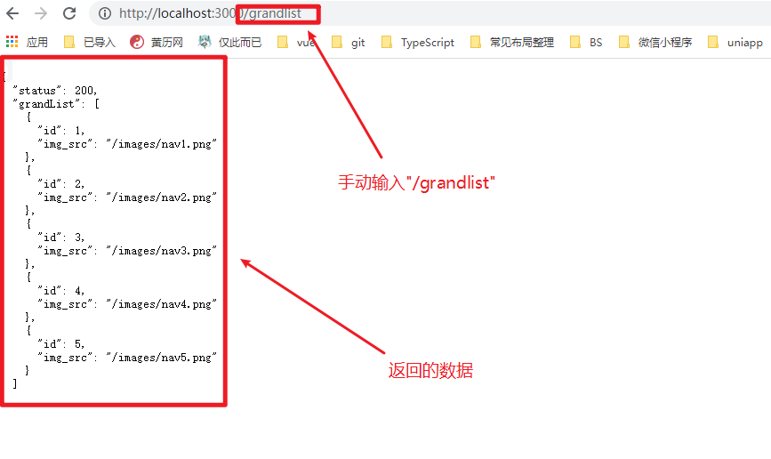
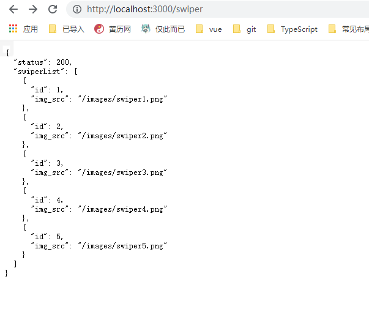
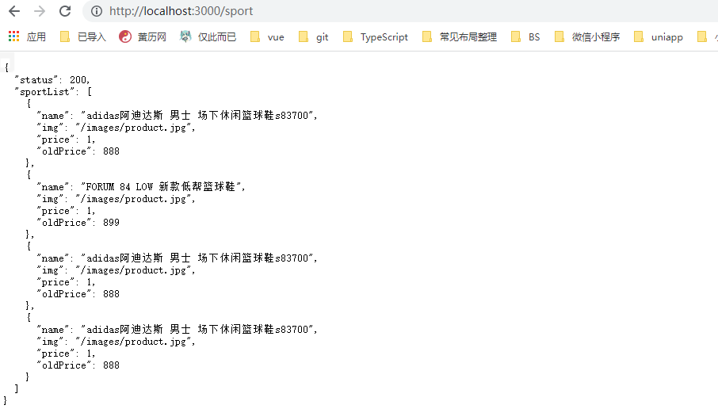
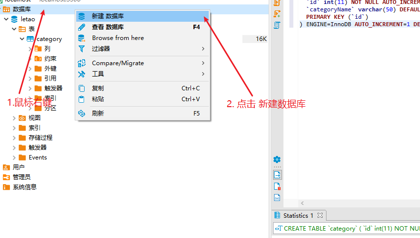
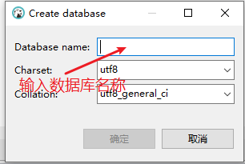
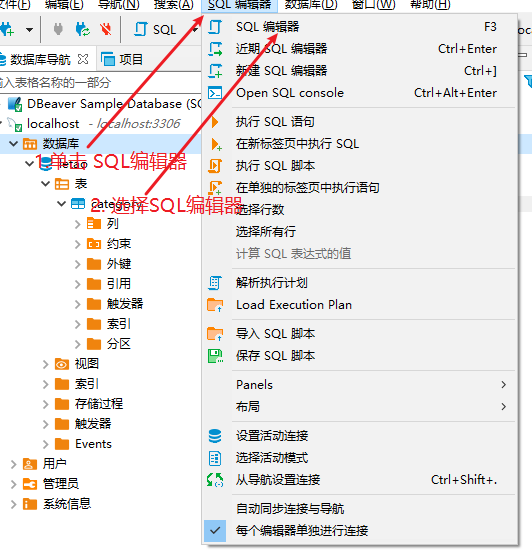
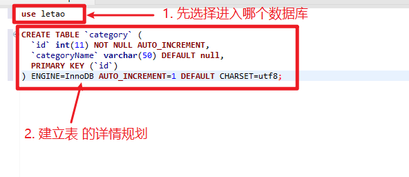

# day-08
> 开发后端
## 首页接口

### 宫格数据 
1. 在路由index.js中新增一个接口为`grandList`的接口
2. 在接口`grandList`中返回数据
`router/index.js`
```js
//#region  首页宫格数据
router.get('/grandlist', async (ctx, next) => {
  ctx.body = {
    status: 200,
    grandList: [
      { id: 1, img_src: "/images/nav1.png" },
      { id: 2, img_src: "/images/nav2.png" },
      { id: 3, img_src: "/images/nav3.png" },
      { id: 4, img_src: "/images/nav4.png" },
      { id: 5, img_src: "/images/nav5.png" }
    ]
  }
})
//#endregion
```





`总结`：
1. 只需要在`routes/index.js`中新增一个api 使用 router.get("/api的名称", (ctx)=> ctx.body={status: 200, grandlist: [{}]})
2. 想让api生效 必须在app.js中导入注册才可以使用

## MVC 设计模式
- MVC 是后端常用的一种设计模式
- M: Model 数据模型
- V: view 视图层 使用model提供的数据 呈现页面
- C: controller 控制层 控制Modle层，在这里逻辑业务的编写
- 优势： 低耦合 数据提供者`model` 不再和view 糅合在一起， 三者相互独立，彻底分离 
> 低耦合：主要都是从对象职责划分的角度说的 封装就是把一些功能放在一个对象之内 高聚合是说一个对象的功能都在内部搞定，紧紧地结合在一起 低耦合是说对象之间的依赖要松散，不要牵一发动全身 只有这样，当系统规模扩大时，才能比较方便（想要了解的更多可以百度）

### 思考MVVM是什么

- MVVM 是前端非常流行的设计思想 只是MVC中的view层
```
M 数据模型
V 视图
VM 模板和数据之前连接的桥梁 Vue实例化时 就是 VM

const Vm = new Vue()
m
data() {}
methods:{}
```

### 总结
- MVC 是后端的一种设计思想 目的时解决 `控制层` `数据层` `视图层` 三者之间的耦合问题
- MVVM: 是针对MVC中的View视图层
  - M: data上的数据
  - V：视图 模板
  - VM： m和V之间的桥梁

## 使用MVC设计模式改造宫格数据

1. 把`routes/index.js` 中的`grandlist接口`按照MVC的结构进行拆分

2. 用户请求接口时 首先会线进入controller层 再控制model层 返回数据给前端(view)

3. controller/index.js 导出了一个grandList控制宫格数据业务

### 代码实现
数据导出`controller/index.js`
```js
module.exports.grandList = async (ctx, next) => {
  ctx.body = {
    status: 200,
    grandList: [
      { id: 1, img_src: "/images/nav1.png" },
      { id: 2, img_src: "/images/nav2.png" },
      { id: 3, img_src: "/images/nav3.png" },
      { id: 4, img_src: "/images/nav4.png" },
      { id: 5, img_src: "/images/nav5.png" }
    ]
  }
}
```
返回数据`routes/indesx.js`
```js
//#region  首页宫格数据
router.get('/grandlist', grandList )
```

## 首页轮播图 运动专区 接口

`controller/index.js`
```js
//#region  首页轮播图业务逻辑控制
module.exports.swiperList = async ctx => {
  ctx.body = {
    status: 200,
    swiperList: [
      { id: 1, img_src: "/images/swiper1.png" },
      { id: 2, img_src: "/images/swiper2.png" },
      { id: 3, img_src: "/images/swiper3.png" },
      { id: 4, img_src: "/images/swiper4.png" },
      { id: 5, img_src: "/images/swiper5.png" }
    ]
  }
}
//#endregion

//#region  首页运动专区 业务逻辑控制
module.exports.sportList = async ctx => {
  ctx.body = {
    status: 200,
    sportList: [
      {
        name: 'adidas阿迪达斯 男士 场下休闲篮球鞋s83700',
        img: '/images/product.jpg',
        price: 1.00,
        oldPrice: 888.00
      },
      {
        name: 'FORUM 84 LOW 新款低帮篮球鞋',
        img: '/images/product.jpg',
        price: 1.00,
        oldPrice: 899.00
      },
      {
        name: 'adidas阿迪达斯 男士 场下休闲篮球鞋s83700',
        img: '/images/product.jpg',
        price: 1.00,
        oldPrice: 888.00
      },
      {
        name: 'adidas阿迪达斯 男士 场下休闲篮球鞋s83700',
        img: '/images/product.jpg',
        price: 1.00,
        oldPrice: 888.00
      }
    ]
  }
}
//#endregion
```

`routes/index.js`
```js 
//#region  首页轮播图数据
router.get('/swiper', swiperList)
//#endregion

//#region  首页运动专区数据
router.get('/sport', sportList)
//#endregion
```





## 使用DBeaver操作数据库

### 安装DBeaver 数据库可视化工具

>  [点击我前往DBeaver安装地址](https://dbeaver.io/download/)

下载安装包之后 选择安装盘符 一直下一步即可使用

### 新建数据库

1. 鼠标右键 【数据库】 鼠标单机 【新建数据库】 



2. 数据数据库名称 点击确定即可




### 新建表






最后刷新侧边栏 即可看见新建表

```mysql
use letao;

CREATE TABLE `category` (
  `id` int(11) NOT NULL AUTO_INCREMENT,    
  `categoryName` varchar(50) DEFAULT null,  
  PRIMARY KEY (`id`)
) ENGINE=InnoDB AUTO_INCREMENT=1 DEFAULT CHARSET=utf8;
```


## 一级分类接口所用的表
就是上面我们 使用DBeaver 创建的category表
1. 使用 create table() {} 创建表
2. 使用inset into 表名 插入数据

```mysql
insert  into `category`(`id`,`categoryName`) 
values (1,'运动馆'),(2,'女士馆'),(3,'男士馆'),(4,'帆布馆'),(5,'户外管');
```

## 表的数据查询
```mysql
-- 查询现在表中所有的信息
select * from category;
-- 查询当前表中的id
select id from category;
-- 查询所有id的属性 并且 匹配到的显示为别名： "索引"
select id as 索引 from category;
select id as 索引1 from category;
-- 查询id为2 的数据
select id='2' from category;

-- 查询表中 id> 3 的 数据
select * from category where id > 3;
-- 查询表中 id > 3 < 4 的数据
select * from category where id > 3 and id < 5;
-- 查询当前表中的categoryName
select categoryName from category;
```


## 试试


