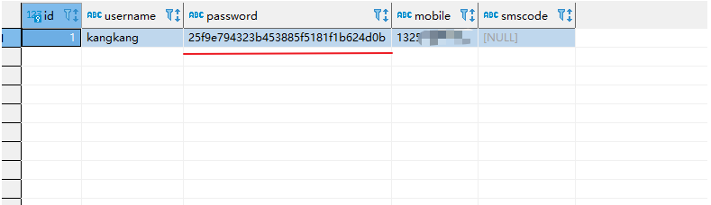
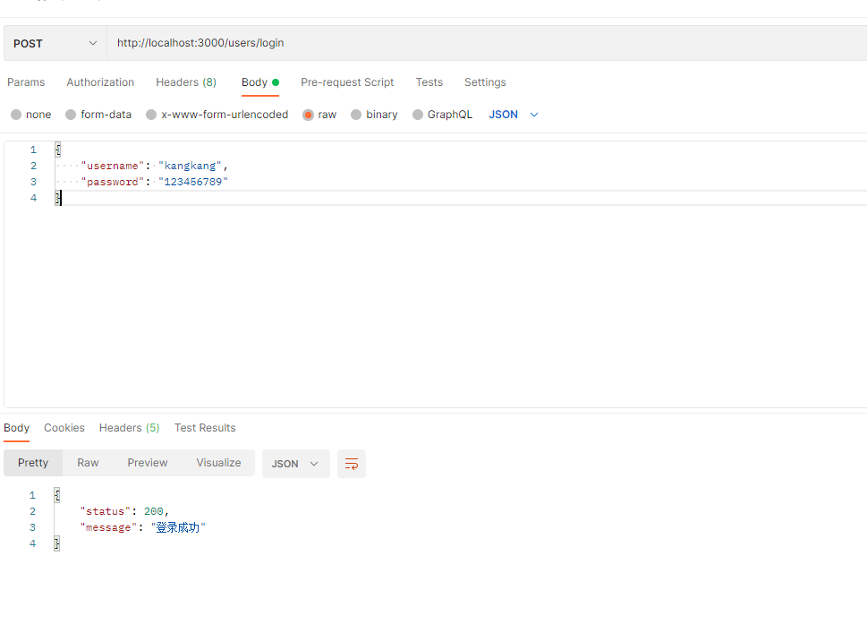

# day-10
## 在用户注册时验证用户是否已经注册
1. 根据用户名查询数据库中 数据表 是否存在该用户
2. 在`model/users.js`层，新建`findUserName` 方法，根据用户名查询用户
```js
//#region  用户查询是否存在
module.exports.findUserByUsername = async (username) => {
  return await query(`select * from user where username = ?`, username);
}
//#endregion
```
3. 在`controller/users.js`，已注册-> 返回提示信息, 否->校验参数-> 存入数据库
```js
//#region  查询用户是否注册
const user = await findUserByUsername(username)
/* 如果已经注册过了就会返回数据 如果没有注册过就不会返回数据 */
if (user[0]) {
  ctx.body= {
    status: 0,
    message: "当前用户名已经注册"
  }
  return
}
//#endregion
```

## 用户密码加密
> 在正常业务逻辑中 为了保证用户的信息安全，一般会对用户密码加密，我们本次使用MD5加密
1. 我们需要使用`Node`中内置的加密模块 [文档地址](https://nodejs.org/dist/latest-v14.x/docs/api/crypto.html)
2. 把加密方法封装成功能放到`utils/index.js` 导出加密方法
```js
//#region  加密方法
// 导入Node内置加密模块
const crypto = require("crypto")
/**
 * 密码加密方法 
 * @param {string} password 用户密码
 * @returns {string} 返回一个MD5加密后的密文
 */
module.exports.cryptoPaddword = (password) => {
  return crypto.createHash('MD5').update(password).digest('hex') 
}
//#endregion
```
3. 方法完成功能时：根据用户密码+字符串加密返回密文后的字符 用户注册时，把密文放入数据库
`controller/users.js`
```js
const result = await register(username, cryptoPaddword(password, "scrict"), mobile);
```


## 用户登录
- 用户的登录时,由于在数据库中保存的是加密密文,用户输入是加密前的信息,所以我们需要再一次解密 验证是否登录成功

1. 在`module/users`定义登录功能
```js
//#region  用户登录查询是否存在信息数据
module.exports.findUserInfo = async (username, password) => {
  return await query("select * from user where username = ? and password = ?", [username,password])
}
//#endregion
```
2. 在`controller/users`执行登录功能 查询数据库中是否存在当前密码加密后的内容
- 在`config/index.js`中定义加盐字符串
```js
// 用户信息加密 加盐字符串(用于加密时生成字符串使用)
module.exports.scrite = 'letao_scrite'
```
- 查询加密内容
```js
//#region  登录功能
module.exports.login = async (ctx) => {
  const { username, password } = ctx.request.body;
  // 在数据库中查询在用户信息数据库中是否存在         密码需要进行加密查询
  const result = await findUserInfo(username, cryptoPaddword(password, scrict))
  /* 如果有用户信息 */
  if (result[0]) {
    ctx.body = {
      status: 200,
      message: "登录成功"
    }
  } else {
    ctx.body = {
      status: 0,
      message: "登录失败 请检查用户名和密码是否正确"
    }
  }
}
//#endregion
```
4. 在`routes/users.js`路由中挂载 login
```js
// 挂载--登录功能
router.post('/login', login)
```
3. 根据查询结果来决定是否登录成功



## 短信验证
### 短信验证的作用
- 验证用户身份 保证用户填写的手机号码的真实性
- 减少非法注册和恶意注册 提高会员注册质量
- 提高网站用户注册的质量 更有效地管理注册用户随时保持练习和沟通

### 阿里云短信服务
- 登录阿里云之后 搜索短信服务 购买或试用服务之后通过上述【快速入门文档】进入文档指引 选择服务类型 签名注册 等
[阿里云短信验证服务-快速入门文档](https://help.aliyun.com/document_detail/108066.html)

[阿里云短信服务-API文档](https://next.api.aliyun.com/api/Dysmsapi/2017-05-25/SendSms?spm=a2c4g.11186623.0.0.6a633e01nGyt8P&sdkStyle=dara&params={}&lang=TYPESCRIPT&tab=DEMO)

[阿里云短信服务-签名注册](https://dysms.console.aliyun.com/dysms.htm#/domestic/text/sign/add)
[阿里云 密匙ID、密匙key创建](https://ram.console.aliyun.com/manage/ak?spm=5176.12438469.top-nav.dak.21381cbe1Uq7eK)
`阿里云相关插件下载 SDK`
```shell
$ npm install @alicloud/pop-core -S
```

**Node SDK 未经过本人使用 请小心使用**
[阿里云短信服务-Node使用案例示范](https://next.api.aliyun.com/api/Dysmsapi/2017-05-25/SendSms?spm=a2c4g.11186623.0.0.ea5624cbYxFMI6&sdkStyle=old&params={}&lang=NODEJS)

### 腾讯云短信服务

#### 购买以及产品介绍网址
[购买以及产品介绍网址](https://cloud.tencent.com/act/pro/csms?fromSource=gwzcw.3193243.3193243.3193243&utm_medium=cpc&utm_id=gwzcw.3193243.3193243.3193243&bd_vid=12653931549666961432)

#### 腾讯短信接入流程
[腾讯短信接入流程](https://cloud.tencent.com/document/product/382/37745)


#### 安装SDK
```shell
yarn add tencentcloud-sdk-nodejs
```

#### 腾讯云短信配置
全局**！！必须!!**变量配置`.env`
```env
DB_ENV=dev
```


短信发送模板`utils/index.js`
```js
//#region  短信发送功能
module.exports.sendsms = async (mobile, smsCode) => {
  //  加载腾讯云 SDK 包
  const tencentcloud = require("tencentcloud-sdk-nodejs")

  // 导入对应产品模块的client models。
  const smsClient = tencentcloud.sms.v20210111.Client

  /* 实例化要请求产品(以sms为例)的client对象 */
  const client = new smsClient({
    credential: {
      /* 必填：腾讯云账户密钥对secretId，secretKey。
       * 这里采用的是从环境变量读取的方式，需要在环境变量中先设置这两个值。
       * 你也可以直接在代码中写死密钥对，但是小心不要将代码复制、上传或者分享给他人，
       * 以免泄露密钥对危及你的财产安全。
       * CAM密匙查询: https://console.cloud.tencent.com/cam/capi */
      secretId: process.env.secretId,
      secretKey: process.env.secretKey,
    },
    /* 必填：地域信息，可以直接填写字符串ap-guangzhou，或者引用预设的常量 */
    region: "ap-guangzhou",
    /* 非必填:
     * 客户端配置对象，可以指定超时时间等配置 */
    profile: {
      /* SDK默认用TC3-HMAC-SHA256进行签名，非必要请不要修改这个字段 */
      signMethod: "HmacSHA256",
      httpProfile: {
        /* SDK默认使用POST方法。
         * 如果你一定要使用GET方法，可以在这里设置。GET方法无法处理一些较大的请求 */
        reqMethod: "POST",
        /* SDK有默认的超时时间，非必要请不要进行调整
         * 如有需要请在代码中查阅以获取最新的默认值 */
        reqTimeout: 30,
        /**
         * SDK会自动指定域名。通常是不需要特地指定域名的，但是如果你访问的是金融区的服务
         * 则必须手动指定域名，例如sms的上海金融区域名： sms.ap-shanghai-fsi.tencentcloudapi.com
         */
        endpoint: "sms.tencentcloudapi.com"
      },
    },
  })

  /* 请求参数，根据调用的接口和实际情况，可以进一步设置请求参数
   * 属性可能是基本类型，也可能引用了另一个数据结构
   * 推荐使用IDE进行开发，可以方便的跳转查阅各个接口和数据结构的文档说明 */
  const params = {
    /* 短信应用ID: 短信SmsSdkAppId在 [短信控制台] 添加应用后生成的实际SmsSdkAppId，示例如1400006666 */
    SmsSdkAppId: process.env.SmsSdkAppId,
    /* 短信签名内容: 使用 UTF-8 编码，必须填写已审核通过的签名，签名信息可登录 [短信控制台] 查看 */
    SignName: "达简网络",
    /* 短信码号扩展号: 默认未开通，如需开通请联系 [sms helper] */
    ExtendCode: "",
    /* 国际/港澳台短信 senderid: 国内短信填空，默认未开通，如需开通请联系 [sms helper] */
    SenderId: "",
    /* 用户的 session 内容: 可以携带用户侧 ID 等上下文信息，server 会原样返回 */
    SessionContext: "",
    /* 下发手机号码，采用 e.164 标准，+[国家或地区码][手机号]
     * 示例如：+8613711112222， 其中前面有一个+号 ，86为国家码，13711112222为手机号，最多不要超过200个手机号*/
    PhoneNumberSet: [`+86${mobile}`],
    /* 模板 ID: 必须填写已审核通过的模板 ID。模板ID可登录 [短信控制台] 查看 */
    TemplateId: process.env.TemplateId,
    /* 模板参数: 若无模板参数，则设置为空*/
    TemplateParamSet: [smsCode],
  }
  // 通过client对象调用想要访问的接口，需要传入请求对象以及响应回调函数
  return await client.SendSms(params, function (err, response) {
    // 请求异常返回，打印异常信息
    if (err) {
      console.log(err)
      return
    }
    // 请求正常返回，打印response对象
    console.log(response)
  })
}
```

#### 阿里云短信云服务参考文档
1. [申请短信服务](https://cloud.tencent.com/act/pro/csms?fromSource=gwzcw.3193243.3193243.3193243&utm_medium=cpc&utm_id=gwzcw.3193243.3193243.3193243&bd_vid=12653931549666961432)
2. [接入流程](https://cloud.tencent.com/document/product/382/37745)
3. [API概述](https://cloud.tencent.com/document/product/382/52077)
4. [SDK使用](https://cloud.tencent.com/document/product/382/43197)
5. [短信云控制台](https://console.cloud.tencent.com/smsv2)
6. [API密匙管理](https://console.cloud.tencent.com/cam/capi)
7. [模板id](https://console.cloud.tencent.com/smsv2/csms-template)


#### 代码实现
`utils/index.js`
```js
//#region  短信发送功能
module.exports.sendsms = async (mobile, smsCode) => {
  //  加载腾讯云 SDK 包
  const tencentcloud = require("tencentcloud-sdk-nodejs")

  // 导入对应产品模块的client models。
  const smsClient = tencentcloud.sms.v20210111.Client

  /* 实例化要请求产品(以sms为例)的client对象 */
  const client = new smsClient({
    credential: {
      /* 必填：腾讯云账户密钥对secretId，secretKey。
       * 这里采用的是从环境变量读取的方式，需要在环境变量中先设置这两个值。
       * 你也可以直接在代码中写死密钥对，但是小心不要将代码复制、上传或者分享给他人，
       * 以免泄露密钥对危及你的财产安全。
       * CAM密匙查询: https://console.cloud.tencent.com/cam/capi */
      secretId: process.env.secretId,
      secretKey: process.env.secretKey,
    },
    /* 必填：地域信息，可以直接填写字符串ap-guangzhou，或者引用预设的常量 */
    region: "ap-guangzhou",
    /* 非必填:
     * 客户端配置对象，可以指定超时时间等配置 */
    profile: {
      /* SDK默认用TC3-HMAC-SHA256进行签名，非必要请不要修改这个字段 */
      signMethod: "HmacSHA256",
      httpProfile: {
        /* SDK默认使用POST方法。
         * 如果你一定要使用GET方法，可以在这里设置。GET方法无法处理一些较大的请求 */
        reqMethod: "POST",
        /* SDK有默认的超时时间，非必要请不要进行调整
         * 如有需要请在代码中查阅以获取最新的默认值 */
        reqTimeout: 30,
        /**
         * SDK会自动指定域名。通常是不需要特地指定域名的，但是如果你访问的是金融区的服务
         * 则必须手动指定域名，例如sms的上海金融区域名： sms.ap-shanghai-fsi.tencentcloudapi.com
         */
        endpoint: "sms.tencentcloudapi.com"
      },
    },
  })

  /* 请求参数，根据调用的接口和实际情况，可以进一步设置请求参数
   * 属性可能是基本类型，也可能引用了另一个数据结构
   * 推荐使用IDE进行开发，可以方便的跳转查阅各个接口和数据结构的文档说明 */
  const params = {
    /* 短信应用ID: 短信SmsSdkAppId在 [短信控制台] 添加应用后生成的实际SmsSdkAppId，示例如1400006666 */
    SmsSdkAppId: process.env.SmsSdkAppId,
    /* 短信签名内容: 使用 UTF-8 编码，必须填写已审核通过的签名，签名信息可登录 [短信控制台] 查看 */
    SignName: "达简网络",
    /* 短信码号扩展号: 默认未开通，如需开通请联系 [sms helper] */
    ExtendCode: "",
    /* 国际/港澳台短信 senderid: 国内短信填空，默认未开通，如需开通请联系 [sms helper] */
    SenderId: "",
    /* 用户的 session 内容: 可以携带用户侧 ID 等上下文信息，server 会原样返回 */
    SessionContext: "",
    /* 下发手机号码，采用 e.164 标准，+[国家或地区码][手机号]
     * 示例如：+8613711112222， 其中前面有一个+号 ，86为国家码，13711112222为手机号，最多不要超过200个手机号*/
    PhoneNumberSet: [`+86${mobile}`],
    /* 模板 ID: 必须填写已审核通过的模板 ID。模板ID可登录 [短信控制台] 查看 */
    TemplateId: process.env.TemplateId,
    /* 模板参数: 若无模板参数，则设置为空*/
    TemplateParamSet: [smsCode],
  }
  // 通过client对象调用想要访问的接口，需要传入请求对象以及响应回调函数
  return await client.SendSms(params, function (err, response) {
    // 请求异常返回，打印异常信息
    if (err) {
      console.log(err)
      return
    }
    // 请求正常返回，打印response对象
    console.log(response)
  })
}
//#endregion
//#region  生成一个指定位数的字符串
module.exports.getRandomByLength = (length) => {
  let code = "";
  for (let i = 0; i < length; i++) {
    code += getRandom(0, 9);
  }
  return code
}
//#endregion

//#region  定义随机数方法
function getRandom(min, max) {
  return Math.floor(Math.random() * (max - min + 1) + min);
}
//#endregion
```

`controller/sms.js`
```js
// 引入公共方法 调用腾讯云短信 接口
const { sendsms, getRandomByLength } = require('../utils')
module.exports.sendsms = async (ctx ) => {
  // 短信验证码
  const code = getRandomByLength(6)
  // 解析传递的手机号
  const { mobile} = ctx.request.body
  const result = await sendsms(mobile, code)
  // 如果短信验证 发送短信成功
  if (result.SendStatusSet[0].Code ==="Ok")
  ctx.body = {
    status: 200,
    code,
    message: "短信发送成功"
  }
}
```

`routes/sms.js`
```js
const router = require("koa-router")();
// * 导入控制层 的 sendsms 方法
const { sendsms } = require("../controller/sms");

// 发送短信接口
router.post('/sendsms', sendsms)
module.exports = router;
```

**注册路由**`app.js`
```js
const sms = require('./routes/sms')
app.use(sms.routes(), sms.allowedMethods())
```