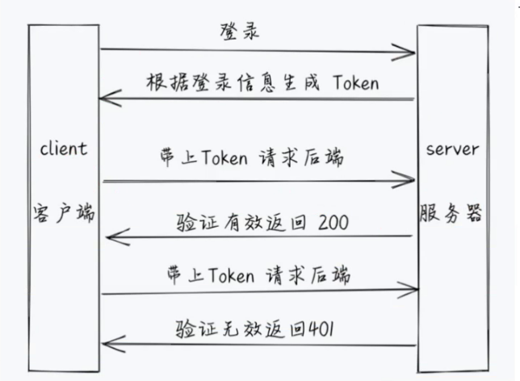
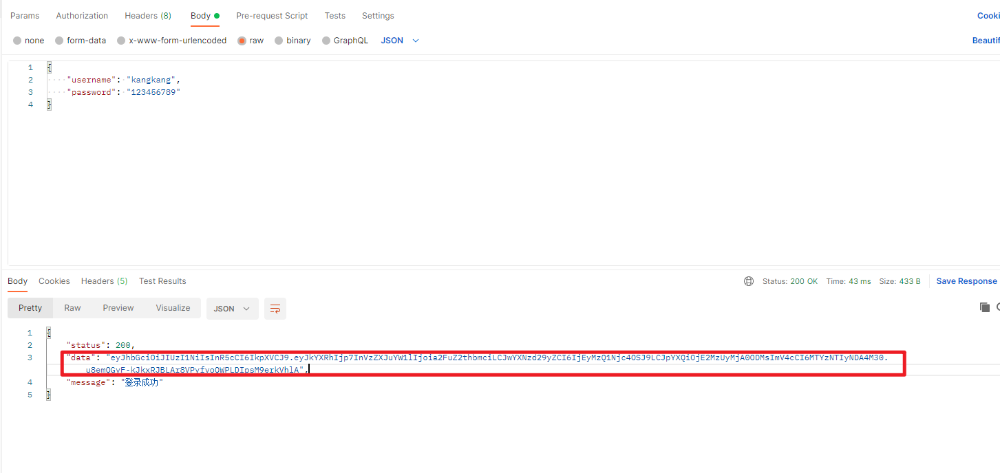
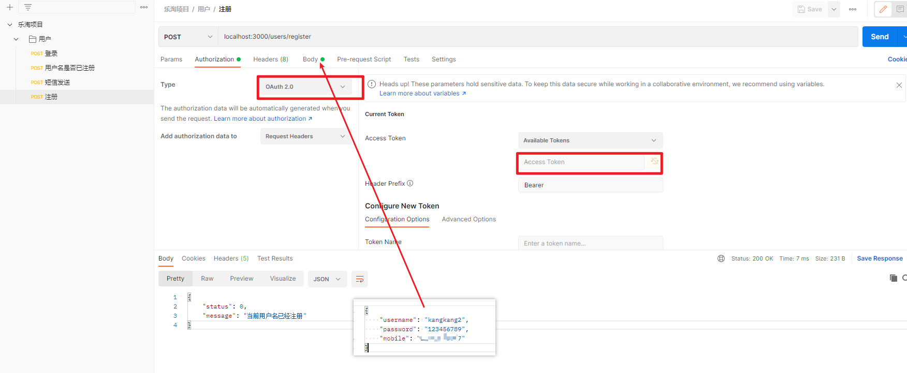
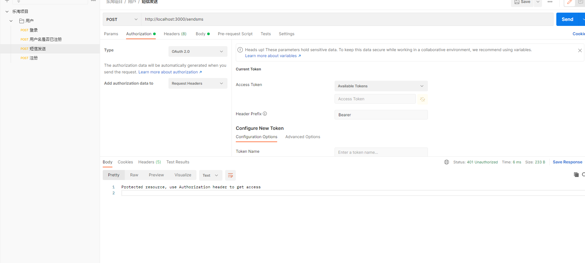
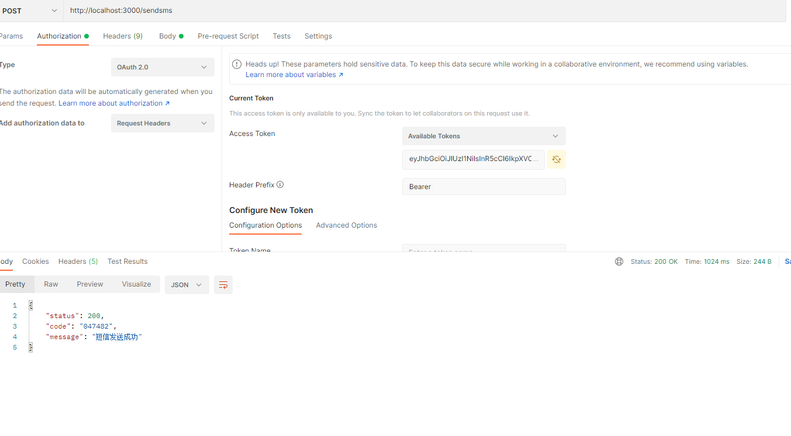
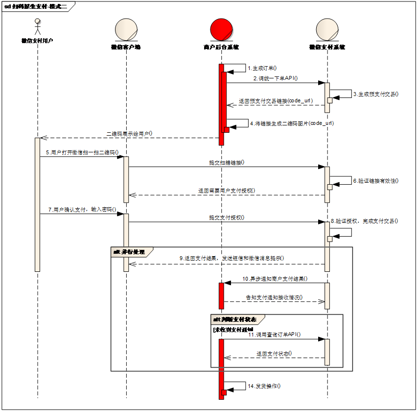

# day-11

## JSON网络令牌 JWT
> JWT 就是身份验证

### JWT 详解
- JWT（JSON Web Token） 是一个开放标准（RFC 7519） 用于在各方之见作为JSON对象安全地传输信息。就是通过用户名和密码生成token确认用户地身份 确认过身份的用户本省为**授权用户（Authenticated user）**
- 是目前最流行的跨域认证解决方案 基本都是先是服务端认证之后 生成一个JSON对象 发回给客户 用户与服务端通信的时候 都要在请求头上带上这个 `JSON对象`

### JSON网络令牌的作用
- 授权： 这是使用JWT最常见的场景。 用户登录之后给个后续请求都将包含JWT，允许用户方位该令牌允许的`路由` `服务` `资源`

### JSON Web Token 结构
在其紧凑的行驶中 JSON Web Token 由用点（.） 分隔的三个部分组成 它们是：
- 标题
  - eyJhbGciOiJIUzI1NiIsInR5cCI6IkpXVCJ9 就是第一部分
  - 加密的方式和类型
- 有效载荷
  - eyJkYXRhIjp7InVzZXJuYW1lIjoia2FuZ2thbmciLCJwYXNzd29yZCI6IjEyMzQ1Njc4OSJ9LCJpYXQiOjE2MzUyMjA0ODMsImV4cCI6MTYzNTIyNDA4M30 第二部分
  - 用户的登录密码和账号加密的结果
- 签名
  - u8emQGyF-kJkxRJBLAr8VPyfvoQWPLDIpsM9erkVhlA 第三部分


可以通过解码网站解密（必须有 加密字符串 才能解密）

所以JWT 通常结构为
```js
xxx.yyy.zzz
// 实例：
eyJhbGciOiJIUzI1NiIsInR5cCI6IkpXVCJ9.
eyJkYXRhIjp7InVzZXJuYW1lIjoia2FuZ2thbmciLCJwYXNzd29yZCI6IjEyMzQ1Njc4OSJ9LCJpYXQiOjE2MzUyMjA0ODMsImV4cCI6MTYzNTIyNDA4M30.
u8emQGyF-kJkxRJBLAr8VPyfvoQWPLDIpsM9erkVhlA
```

> 用户信息 + 加密字符串 = Token
>
> usename&pasword + jwtSecret = Token

### JSON网络令牌如何工作

在身份验证中 当用户使用其凭证登录时 将返回JSON Web Token 由于令牌时凭证 因此必须非常小心以防止安全问题 通常 您不应该将令牌保留额的时间 超过所需的时间

每当用户想要访问受保护的路由或资源时 用户代理应该发送JWT 长使用`Bearer`模式的`Authorization`标头中 
```js
Authorization: Bearer<token>
```


## JST 代码实现
1. 安装`jsonwebtoken`
[jsonwebtoken文档地址](https://npmjs.com/package/jsonwebtoken)
```shell
yarn add jsonwebtoken
# or
npm install jsonwebtoken
```
2. 在登录成功后 生成jwt
`config/index.js`
```js
// 用户信息加密 加盐字符串(用于加密时生成字符串使用)
module.exports.scrite = 'letao_scrite'

// jwt 用户加密字符串
module.exports.jwtScrite = "letao_jwt_scrite"
```

`controler/users.js`
```js
// 登录加密字符串 jwt加密字符串
const { scrict, jwtScrite } = require('../config')
module.exports.login = async (ctx) => {
  const { username, password } = ctx.request.body;
  // 在数据库中查询在用户信息数据库中是否存在         密码需要进行加密查询
  const result = await findUserInfo(username, cryptoPaddword(password, scrict))
  /* 如果有用户信息 */
  if (result[0]) {
    // 用户登录成功 根据用户名和密码生成Token
    const token = jwt.sign({
      data: {username,password}
    }, jwtScrite, { expiresIn: '1h' });

    ctx.body = {
      status: 200,
      //给客户端返回jwt
      data:token,
      message: "登录成功"
    }
  } else {
    ctx.body = {
      status: 0,
      message: "登录失败 请检查用户名和密码是否正确"
    }
  }
}
```
注意:每一次登录都会生成一个新的Token
### PostMan 接口测试结果



### 判断接口是否需要jwt权限校验
> 并不是所有的接口都需要进行`token权限校验`,比如登录和注册

1. 安装koa-jwt
- koa-jwt 用于验证JSON Web Token 令牌的中间件
```shell
yarn add koa-jwt
# or
npm install koa-jwt
```
2. 在`app.js`中使用
```js
const jwt = require('koa-jwt') // 引入koa-jwt
const { jwtScrite } = require('./config') // 引入jwt加密字符串
//#region  使用koa-jwt中间件 拦截客户端调用服务端接口时 如果没有带token就返回401
app.use(function (ctx, next) {
  return next().catch((err) => {
    if (401 == err.status) {
      ctx.status = 401;
      ctx.body = 'Protected resource, use Authorization header to get access\n';
    } else {
      throw err;
    }
  });
});
//#endregion

//#region  设置哪些接口不需要设置token
/**
 * secret 必须是token生成时的加密字符串
 * ubless 排除哪些请求不需要token 登录login与注册register 无需token
 */
app.use(jwt({ secret: jwtScrite })
  .unless({ path: [/^\/public/, /^\/users\/login/, /^\/users\/register/] }));
//#endregion
```
**无需使用jwt生成的token的接口**



**需要使用jwt生成的token的接口 却没有使用的结果**


**需要使用jwt 正确使用的结果**




## 微信订单支付
> 指通过 商户系统按照`微信支付协议`生成支付二维码 用户通过扫描二维码进行支付 
[微信支付文档地址](https://pay.weixin.qq.com/wiki/doc/api/index.html)

### 微信支付申请流程
> 个人无法进行申请 且只有**服务号**才拥有服务功能
#### 注册公众号
- [个体工商户](http://kf.qq.com/faq/120911VrYVrA151009JB3i2Q.html)
- [企业/公司](http://kf.qq.com/faq/120911VrYVrA151013MfYvYV.html)
- [政府](http://kf.qq.com/faq/120911VrYVrA15100973ABZz.html)
- [媒体](http://kf.qq.com/faq/120911VrYVrA151013aMNfeQ.html)
- [其他组织](http://kf.qq.com/faq/120911VrYVrA151013nYFZ7Z.html)

#### 认证公众号

公众号认证后才可申请微信支付，认证费：300元/次 查看[认证流程](http://kf.qq.com/product/weixinmp.html#hid=97)

#### 提交资料申请微信支付

登录公众平台，点击左侧菜单【微信支付】，开始填写资料等待审核，审核时间为48小时内。

#### 开户成功，进行账户验证

资料审核通过后，开户信息会通过邮件、公众号发送给联系人，请按照指引填写财付通备付金汇入的随机金额，完成账户验证。（查看验证方法）

#### 在线签署协议

本协议为线上电子协议，签署后方可进行交易及资金结算，签署完立即生效。点此提前预览协议内容。
#### 启动设计和开发

支付接口已获得，可根据[开发文档](https://pay.weixin.qq.com/wiki/doc/api/index.html)进行开发，也可了解成功案例界面示意及素材。

### 准备素材

- [扫码支付](https://pay.weixin.qq.com/wiki/doc/api/native.php?chapter=6_1)
- APPID [公众平台](https://mp.weixin.qq.com/)(1959583119)->右上角->开发者ID->AppID
- 商户号码和配置回调链接 [商户平台](https://pay.weixin.qq.com/)->产品中心->开发配置->商户信息->商户号
- 配置APPID [商户平台](https://pay.weixin.qq.com/)->产品中心->APPID授权管理
- API密钥 [商户平台](https://pay.weixin.qq.com/)->账户中心->API安全->设置API密钥

### 微信API接入流程

- 商户后台系统先调用微信支付的统一下单接口
- 微信后台系统返回链接参数code_url
- 商户后台系统将code_url值生成二维码图片
- 用户使用微信客户端扫码后发起支付
- 注意：code_url有效期为2小时，过期后扫码不能再发起支付。



> 详细业务接入流程

- 1）商户后台系统根据用户选购的商品生成订单。
- 2）用户确认支付后调用微信支付[统一下单API](https://pay.weixin.qq.com/wiki/doc/api/native.php?chapter=9_1)生成预支付交易；
- 3）微信支付系统收到请求后生成预支付交易单，并返回交易会话的二维码链接code_url。
- 4）商户后台系统根据返回的code_url生成二维码。
- 5）用户打开微信“扫一扫”扫描二维码，微信客户端将扫码内容发送到微信支付系统。
- 6）微信支付系统收到客户端请求，验证链接有效性后发起用户支付，要求用户授权。
- 7）用户在微信客户端输入密码，确认支付后，微信客户端提交授权。
- 8）微信支付系统根据用户授权完成支付交易。
- 9）微信支付系统完成支付交易后给微信客户端返回交易结果，并将交易结果通过短信、微信消息提示用户。微信客户端展示支付交易结果页面。
- 10）微信支付系统通过发送异步消息通知商户后台系统支付结果。商户后台系统需回复接收情况，通知微信后台系统不再发送该单的支付通知。
- 11）未收到支付通知的情况，商户后台系统调用[查询订单API](https://pay.weixin.qq.com/wiki/doc/api/native.php?chapter=9_2)
- 12）商户确认订单已支付后给用户发货。