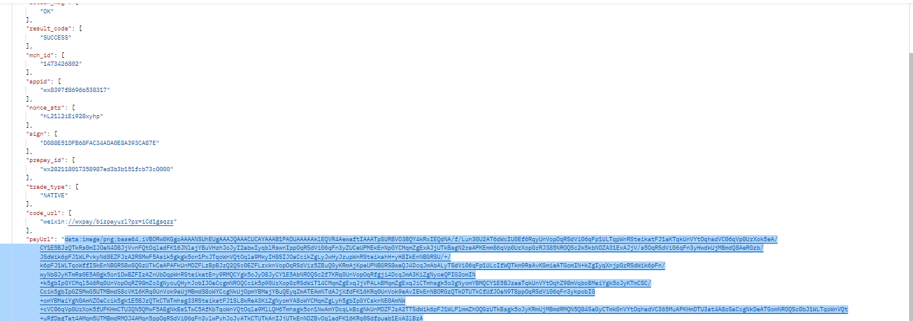

# day-12

## 微信支付
- 我们在使用微信扫码支付时 需要调用微信的下单接口 把需要的参数我们得提前处理 比如签名 随机字符串 完成之后 我们可以拿到下单接口返回的核心内容 code_url生成一张支付二维码给前端

> 需要安装axios
```shell
yarn add axios
```
### 微信支付代码结构

1. 在`routes/order.js`中创建路由
```js
const router = require('koa-router')();
const { order } = require("../controller/order");
// 微信下单
router.post('/order', order);

module.exports = router
```

2. 在`app.js`中改在`order`路由接口
```js
// 订单微信支付
const order = require("./routes/order") 
app.use(order.routes(), order.allowedMethods())
```
3. 创建controller层的`order.js`
```js
const { createOrder } = require("../utils")
// 微信下单
module.exports.order =async ctx => {
  // 微信下单必须参数
  const params = {
    appid, // app id
    mch_id, // 商户号id
    noce_str, // 32位以内的随机字符串
    sign, // 签名
    body, // 商品描述
    out_trade_no, // 商户订单号
    title_fee, // 商品标价
    spbill_create_ip, // 商户终端ip
    notify_url, // 微信服务器回调的地址
    trade_type, // 支付类型
  }
  const data = await createOrder(url,params)
  ctx.body = {
    status: 200,
    data
  }
  console.log(data)
}
```

4. 在`utils/index.js`中定义并导出 微信下单方法
```js
//#region  微信下单
module.exports.createOrder = (url,params) => {
  return new Promise(async (resolve, reject) => {
    const data = await axios({
      url: url,
      method: 'POST',
      data: params
    })
    resolve(data)
  })
}
//#endregion
```
5. 创建`config/wx.js`文件 用以存放与微信支付相关的参数代码
```js
// 微信下单参数配置
module.exports.orderUrl = 'https://api.mch.weixin.qq.com/pay/unifiedorder';
```

### 定义appid、商户号、随机位字符串方法
- appid 商户号
`config/wx.js`
```js
// appid
module.exports.appid = 'wx8397f8696b538317';
// 商户号
module.exports.mch_id = '1473426802';
```

- 定义appid、商户号、随机位字符串方法
`utils/index.js`
```js
//#region  生成32位以内的随机字符串
module.exports.getRandomStr = () => {
  return'letao'+this.getRandomByLength(10) + new Date().getTime()
}
//#endregion
```

### 商户订房单号
`utils/index.js`
```js
//#region  生成32位以内商户订单号
module.exports.getTrade_no = () => {
  return 'Trade_no'+ this.getRandomStr()+ this.getRandomByLength(6)
}
//#endregion
```

### 生成签名算法
1. 请求参数对象（parmas）按照把所有的`键`进行`sort`排序 转成格式为key=value&key=value···的格式
2. 在最后的结果中拼接`key`值（商户后台中的key）
3. 拿到的最终字符串进行MD5加密
微信签名算法所需要的最后一个 `key` `appid` `mch_id` 
`config/wx.js`
```js
// appid
module.exports.appid = 'wx8397f8696b538317';
// 商户号
module.exports.mch_id = '1473426802';
// 商户号中的key ~sign中字符串所需要的最后一个key的字符~
module.exports.key = 'T6m9iK73b0kn9g5v426MKfHQH7X8rKwb';
```
生成签名算法
`utils/index.js`
```js
const { key } = require('../config/wx')
//#region  生成签名算法
module.exports.createSign = (args) => {
  let stringA = '';
  // 拿到传递过来的对象的键之后 进行Ascii码升序排列 以key=value&key=value的方式拼接
  Object.keys(args).sort().forEach(key => {
    stringA += `${key}=${args[key]}&`
  })
  stringA+= `key=${key}`
  return stringA;
}
//#endregion
```

生成签名
```js
const { createOrder, getTrade_no, getRandomStr } = require("../utils")
// 引入 appid 商户订单号
const { appid, mch_id, notify_url } = require('../config/wx')
// 引入签名算法
const { createSign } = require('../utils')
// 微信下单
module.exports.order =async ctx => {
  // 前端 调用下单接口时 传递的参数
  const { body, total_fee,trade_type, spbill_create_ip } = ctx.request.body
  // 微信下单必须参数
  const params = {
    appid, // app id
    mch_id, // 商户号id
    noce_str: getRandomStr(), // 32位以内的随机字符串
    body, // 商品描述
    out_trade_no: getTrade_no(), // 商户订单号
    total_fee, // 商品标价
    spbill_create_ip, // 商户终端ip
    notify_url, // 微信服务器回调的地址
    trade_type, // 支付类型
  }
  // 生成签名
  const sign = createSign(params)
  console.log(sign)
    // 新增sign属性  签名属性根据appid 和商户订单号生成
  params.sign = sign
  // const data = await createOrder(url,params)
  // ctx.body = {
  //   status: 200,
  //   data
  // }
}
```

> 由于JWT会对测试造成一定的妨碍，所以可以先注释掉

#### 签名算法结果MD5加密
`utils/index.js`
```js
module.exports.createSign = (args) => {
  let stringA = '';
  // 拿到传递过来的对象的键之后 进行Ascii码升序排列 以key=value&key=value的方式拼接
  Object.keys(args).sort().forEach(key => {
    stringA += `${key}=${args[key]}&`
  })
  stringA += `key=${key}`
  // MD5加密转大写 
  return crypto.createHash('MD5').update(stringA).digest('hex').toUpperCase();
}
//#endregion
```

#### 使用reduce修改拼接字符串的方式
`utils/index.js`
```js
//#region  生成签名算法
module.exports.createSign = (args) => {
  // let stringA = '';
  // 拿到传递过来的对象的键之后 进行Ascii码升序排列 以key=value&key=value的方式拼接
  // Object.keys(args).sort().forEach(key => {
  //   stringA += `${key}=${args[key]}&`
  // })
  // stringA += `key=${key}`
  // 使用reduce方法处理字符串
  const stringA =   Object.keys(args).sort().reduce((prev,next) => {
    return `${next}=${args[next]}&`
  }, "").concat(`key=${key}`)
  // MD5加密转大写 
  return crypto.createHash('MD5').update(stringA).digest('hex').toUpperCase();
}
//#endregion
```

### 下单完成
> 按照微信官方文档 调通微信下单接口
1. 定义变量 存放`XML`格式的请求参数


2. `utils/index.js` 中创建订单方法 返回的数据也是XML格式 我们需要安装第三方库 解析返回的数据 xml2js
```shell
yarn add xml2js
```
```js
//#region  微信下单
module.exports.createOrder =  (url,params) => {
  return new Promise(async (resolve, reject) => {
    const data = await axios({
      url: url,
      method: 'post',
      data: params
    })
    // console.log(data,'data')
    // resolve(data)
    xml.parseString(data.data, (err, data) => {
      if (err) reject(err)
      const { return_code, result_code, return_msg } = data.xml
      if (return_code == "SUCCESS" && result_code == "SUCCESS" && return_msg == "OK") {
        resolve(data.xml)
      } else {
        reject(data)
      }
    })
  })
}
//#endregion
```
3. 在`controller/order.js`中调用下单方法 拿到数据 返回给客户端
```js
const { createOrder, getTrade_no, getRandomStr } = require("../utils")
// 引入 appid 商户订单号 随机字符串
const { appid, mch_id, notify_url,orderUrl } = require('../config/wx')
// 引入签名算法
const { createSign } = require('../utils')
// 微信下单
module.exports.order = async ctx => {
  // 前端 调用下单接口时 传递的参数
  const { body, total_fee, trade_type, spbill_create_ip } = ctx.request.body
  // 微信下单必须参数
  const params = {
    appid, // app id
    mch_id, // 商户号id
    nonce_str: getRandomStr(), // 32位以内的随机字符串
    body, // 商品描述
    out_trade_no: getTrade_no(), // 商户订单号
    total_fee, // 商品标价
    spbill_create_ip, // 商户终端ip
    notify_url, // 微信服务器回调的地址
    trade_type, // 支付类型
  }
  // 生成签名
  const sign = createSign(params)
  console.log(sign)
  // 新增sign属性  签名属性根据appid 和商户订单号生成
  params.sign = sign

  let sendData = `
    <xml>
      <appid>${appid}</appid>
      <body>${body}</body>
      <mch_id>${mch_id}</mch_id>
      <nonce_str>${params.nonce_str}</nonce_str>
      <notify_url>${notify_url}</notify_url>
      <out_trade_no>${params.out_trade_no}</out_trade_no>
      <spbill_create_ip>${spbill_create_ip}</spbill_create_ip>
      <total_fee>${total_fee}</total_fee>
      <trade_type>${trade_type}</trade_type>
      <sign>${sign}</sign>
    </xml>
  `
  const data = await createOrder(orderUrl,sendData)
  ctx.body = {
    status: 200,
    data
  }
}
```


### 根据微信支付官方返回的数据 生成二维码
我们通过以上步骤找到了微信支付 返回的数据（`code_url`） 

1. 下载qrcode 处理`code_url` 生成二维码图片（base64格式图片）
```shell
yarn add qrcode
```

2. 把二维码连接返回给客户端
```js
const { createOrder, getTrade_no, getRandomStr } = require("../utils")
// 引入 appid 商户订单号 随机字符串
const { appid, mch_id, notify_url,orderUrl } = require('../config/wx')
// 引入签名算法
const { createSign } = require('../utils')
// 引入qrcode库
const QRCode = require('qrcode')
// 微信下单
module.exports.order = async ctx => {
  // 前端 调用下单接口时 传递的参数
  const { body, total_fee, trade_type, spbill_create_ip } = ctx.request.body
  // 微信下单必须参数
  const params = {
    appid, // app id
    mch_id, // 商户号id
    nonce_str: getRandomStr(), // 32位以内的随机字符串
    body, // 商品描述
    out_trade_no: getTrade_no(), // 商户订单号
    total_fee, // 商品标价
    spbill_create_ip, // 商户终端ip
    notify_url, // 微信服务器回调的地址
    trade_type, // 支付类型
  }
  // 生成签名
  const sign = createSign(params)
  console.log(sign)
  // 新增sign属性  签名属性根据appid 和商户订单号生成
  params.sign = sign

  let sendData = `
    <xml>
      <appid>${appid}</appid>
      <body>${body}</body>
      <mch_id>${mch_id}</mch_id>
      <nonce_str>${params.nonce_str}</nonce_str>
      <notify_url>${notify_url}</notify_url>
      <out_trade_no>${params.out_trade_no}</out_trade_no>
      <spbill_create_ip>${spbill_create_ip}</spbill_create_ip>
      <total_fee>${total_fee}</total_fee>
      <trade_type>${trade_type}</trade_type>
      <sign>${sign}</sign>
    </xml>
  `
  const data = await createOrder(orderUrl, sendData)


  // 下单成功 转码图片地址为base64格式
  const { return_code, result_code, return_msg,code_url } = data
  if (return_code == "SUCCESS" && result_code == "SUCCESS" && return_msg == "OK") {
    data.payUrl = await QRCode.toDataURL(code_url)
  } 
  ctx.body = {
    status: 200,
    data
  }
}
```
3. 再浏览器地址栏中 输入base64图片地址 扫码支付

