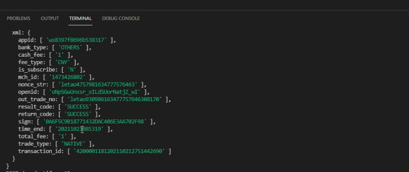

# day-13

## 微信下单

### 微信下单回调

我们调用微信下单接口时 返回code_url  使用code_url生成支付用的二维码 用户扫码支付 支付之后商家要知道支付的结果（未支付、支付成功） 此时微信服务器会调用 商家提供的回调地址（项目服务器后端服务接口） 必须提供 而且部署到服务器且拥有域名

1. 按照MVC结构编译下单回调接口
`routes/order.js`
```js
router.post('/pay/notify', notify);
```
2. 下载 `koa-xml-body` 解析和生成xml格式的数据
[koa-xml-body官方文档地址](https://www.npmjs.com/package/koa-xml-body)
```shell
yarn add koa-xml-body
```
`app.js`
```js
const xmlParser = require('koa-xml-body')
app.use(xmlParser())
```
`controller/order.js`
```js
//#region  微信下单回调通知
module.exports.notify = async (ctx) => {
  // 打印微信服务器回调你的接口时的请求报文
  console.log(ctx.request.body.xml)
}
//#endregion
```


3. 把微信下单接口回调结构部署到服务器
> **一定要在服务器端部署 且拥有域名**

### 微信支付订单表
​    微信下单回调之后，我们需要把回调参数，写入到数据库订单表中，所有我们需要在服务器数据库中创建一个订单表。

1.   在服务器上创建数据库letaodb，创建一个订单表payorder
```mysql
CREATE TABLE `payorder` (
  `id` int(11) NOT NULL AUTO_INCREMENT,
  `appid` varchar(50) NOT NULL,
  `bank_type` varchar(50) NOT NULL,
  `cash_fee` varchar(50) NOT NULL,
  `fee_type` varchar(50) NOT NULL,
  `is_subscribe` varchar(50) NOT NULL,
  `mch_id` varchar(50) NOT NULL,
  `nonce_str` varchar(50) NOT NULL,
  `openid` varchar(50) NOT NULL,
  `out_trade_no` varchar(50) NOT NULL,
  `sign`varchar(50) NOT NULL,
  `time_end` varchar(50) NOT NULL,
  `total_fee` varchar(50) NOT NULL,
  `trade_type`  varchar(50) NOT NULL,
  `transaction_id` varchar(50) NOT NULL,
   PRIMARY KEY (`id`)
)
```

### 订单数据写入数据库
微信下单之后需要将订单数据写入数据库

1. 需要在ctx中解构出所有的订单参数
2. 使用封装好的query方法 向订单表写入数据
`controller/order.js`
```js
//#region  微信下单回调通知
module.exports.notify = async (ctx) => {
  // 打印微信服务器回调你的接口时的请求报文
  console.log(ctx.request.body.xml)
  const {
    appid,
    bank_type,
    cash_fee,
    fee_type,
    is_subscribe,
    mch_id,
    nonce_str,
    openid,
    out_trade_no,
    sign,
    time_end,
    total_fee,
    trade_type,
    transaction_id
  } = ctx.request.body.xml
  // 查询是否存在此订单
  const data = await query(`select * from payorder where out_trade_no = "${out_trade_no}"`)
  // 如果数据库中存在此条订单数据 就终止后续插入数据库语法代码执行
  if (data.length) return;
  // 插入数据库
  const result = await query(`insert into payorder(appid, bank_type,cash_fee,fee_type,is_subscribe,mch_id,nonce_str,openid,out_trade_no,sign,time_end,total_fee,trade_type,transaction_id) values('${appid}','${bank_type}','${cash_fee}','${fee_type}','${is_subscribe}','${mch_id}','${nonce_str}','${openid}','${out_trade_no}','${sign}','${time_end}','${total_fee}','${trade_type}','${transaction_id}')`);
  return result;

  // 相应微信服务器接口 订单处理成功 无需重复通知
  ctx.body = `
  <xml>
    <return_code><![CDATA[SUCCESS]]></return_code>
    <return_msg><![CDATA[OK]]></return_msg>
  </xml>
  `
}
//#endregion
```

### 订单查询
当用户支付，或加入订单的时候用户可能需要订单的状态

1. 按照MVC结构 实现订单查询
`routes/order.js`
```js
const router = require('koa-router')();
const { order, notify, queryOrder } = require("../controller/order");
// 微信下单
router.post('/order', order);

// 微信下单回调
router.post('/pay/notify', notify);
// 微信订单查询
router.post('/queryOrder',queryOrder)
module.exports = router
```

`utils/index.js`
```js

//#region  生成一个指定位数的字符串
module.exports.getRandomByLength = (length) => {
  let code = "";
  for (let i = 0; i < length; i++) {
    code += getRandom(0, 9);
  }
  return code
}
//#endregion

//#region  定义随机数方法
function getRandom(min, max) {
  return Math.floor(Math.random() * (max - min + 1) + min);
}
  //#endregion


//#region  微信下单
module.exports.createOrder =  (url,params) => {
  return new Promise(async (resolve, reject) => {
    const data = await axios({
      url: url,
      method: 'post',
      data: params
    })
    // console.log(data,'data')
    // resolve(data)
    xml.parseString(data.data, (err, data) => {
      if (err) reject(err)
      // 结构data 查看返回的数据中是否存在需要的值 用以判断是否成功
      const { return_code, result_code, return_msg } = data.xml
      if (return_code == "SUCCESS" && result_code == "SUCCESS" && return_msg == "OK") {
        resolve(data.xml)
      } else {
        reject(data)
      }
    })
  })
}
//#endregion

//#region  生成32位以内的随机字符串
module.exports.getRandomStr = () => {
  return 'letao' + this.getRandomByLength(10)
}
//#endregion


//#region  生成32位以内商户订单号
module.exports.getTrade_no = () => {
  return 'Trade_no'+ this.getRandomStr()+ this.getRandomByLength(6)
}
//#endregion

// 微信订单查询
module.exports.queryOrder = (url, params) => {
  return new Promise(async (resolve, reject) => {
    const data = await axios({
      url: url,
      method: 'post',
      data: params
    })
    // console.log(data,'data')
    // resolve(data)
    xml.parseString(data.data, (err, data) => {
      if (err) reject(err)
      // 结构data 查看返回的数据中是否存在需要的值 用以判断是否成功
      const { return_code, result_code, return_msg } = data.xml
      if (return_code == "SUCCESS" && result_code == "SUCCESS" && return_msg == "OK") {
        resolve(data.xml)
      } else {
        reject(data)
      }
    })
  })
}
```

`controller/order.js`
```js
//#region  微信订单查询
module.exports.queryOrder = async (ctx) => {
  // 保证下单和查询的时候nonce_str、out_trade_no是同一个
  const { nonce_str, out_trade_no } = commonParams
  const params = {
    appid,
    mch_id,
    nonce_str,
    out_trade_no,
    sign
  }
  // 生成签名
  let sign = createSign(params);
  let sendData = `
  <xml>
    <appid>${appid}</appid>
    <mch_id>${mch_id}</mch_id>
    <nonce_str>${nonce_str}</nonce_str>
    <out_trade_no>${out_trade_no}</out_trade_no>
    <sign>${sign}</sign>
  </xml>
  `

  const data = await queryOrder(queryOrderUrl,sendData)
  ctx.body = {
    status: 200,
    data
  }
}
//#endregion
```
2. 在utils/index.js中 封装订单查询
3. postMan请求调用测试 

### 订单表
调用微信下单接口 根据code_url使用qrcode生成支付二维码 返给前端 此时订单就已经产生 只不过没有支付 当用户支付成功我们需要回调乐淘服务端 结构 修改订单状态为已支付
